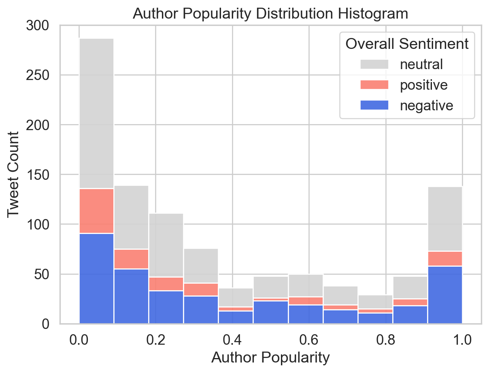

<!-- Hi, I'm **Pinn** — a data enthusiast working at the intersection of analysis, storytelling, and code.  -->

<!-- This site collects my data projects: exploratory analyses, NLP experiments, and interactive visualizations built with **R** and **Python**, published with [Quarto](https://quarto.org/). -->

This site collects my data analysis projects, web tools, and blogs. Data projects are built with **R** and **Python**, published with [Quarto](https://quarto.org/){target="_blank"}. Web tools are developed with React, Next.js, and TypeScript.

<!-- : exploratory analyses, NLP experiments, and interactive visualizations built with **R** and **Python**, published with [Quarto](https://quarto.org/). -->

:::{style="line-height:3.6;"}
[Browse All Projects →](projects/){.btn .btn-primary style="margin-right:12px"}
[Data Viz Tutorials](tutorials/){.btn .btn-outline-primary}
:::

## Featured Projects {#featured-projects}

::: {#projects}
:::

<!-- 

::::::: grid
::: {.g-col-12 .g-col-md-6 .featured-card}

[**Twitter Sentiment Analysis of Catalan Referendum**](projects/catalan-referendum/){.stretched-link}\
Sentiment mining on tweets surrounding the 2017 Catalan independence referendum.\
`Python` `NLP` `Social Media`
:::

::: {.g-col-12 .g-col-md-6 .featured-card}
[**Global Visa Cost Analysis**](projects/global-visa-cost/){.stretched-link}\
A comparative study of visa costs across countries, exploring affordability and geographic patterns.\
`Python` `EDA` `Visualization`
:::

::: {.g-col-12 .g-col-md-6 .featured-card}
[**Most Streamed Songs on Spotify 2023**](projects/most-streamed-songs/){.stretched-link}\
Exploratory analysis of the most-streamed tracks on Spotify, uncovering trends in music popularity.\
`R` `EDA` `Visualization`
:::

::: {.g-col-12 .g-col-md-6 .featured-card}
[**Student Social Media Usage & Addiction**](projects/student-media-usage/){.stretched-link}\
Analysis of social media habits and addiction patterns among students.\
`R` `EDA` `Social Media`
:::
::::::: 

-->

------------------------------------------------------------------------

[About this site →](about/){.btn .btn-outline-primary}