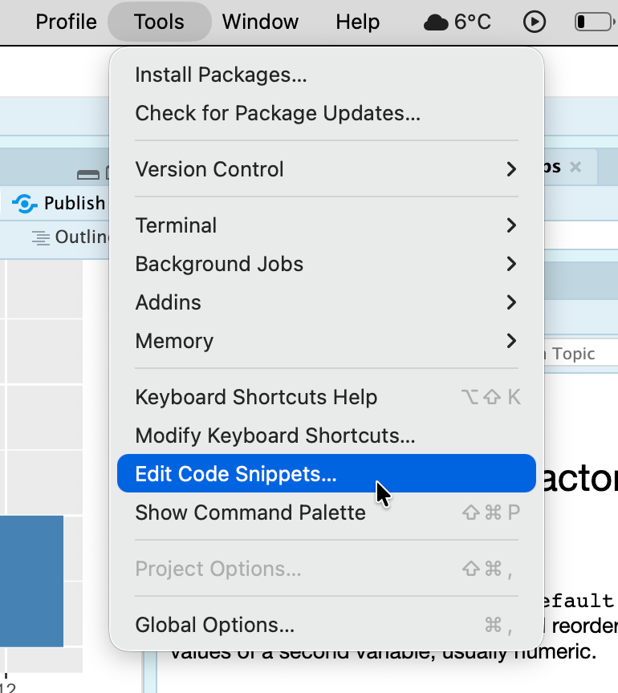
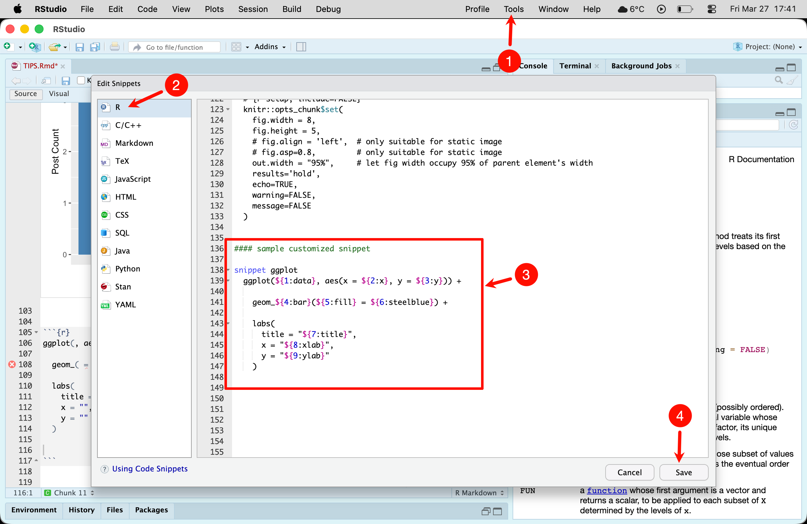
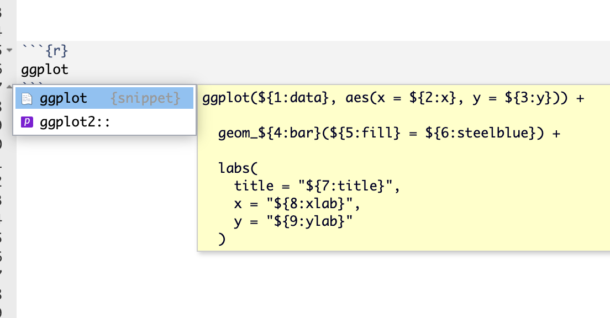
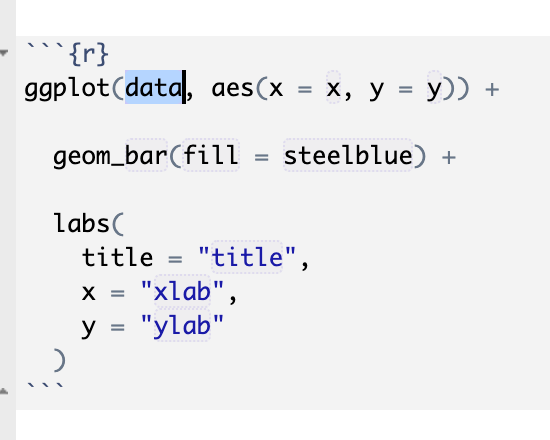

# Top Tips {.unnumbered}

| Tip | Notes |
|------|------|
| [Relative Paths](#relative-paths) | Keep data and code in the same folder; use relative paths to avoid errors caused by spaces in paths |
| Add `na.rm = TRUE` to stats | Required for `sum`, `mean`, `sd`, `IQR`, etc.; otherwise returns NA when missing values exist |
| Clarify unit of observation | Confirm what each row represents;<br>for mixed types (e.g. post/comment), filter first: `filter(type == "post")` |
| Name computed columns inside `count()` | e.g. <code>count(<span style="color:#d04255">month</span> = month(date))</code> |
| Distinguish `filter()` from `select()` | `filter(condition)` filters rows; `select(col)` selects columns [(filter operators)](#logical-operators-in-filter) |
| Use `nrow()` / `pull()` to extract values | `nrow()` returns row count; `pull()` extracts a single value from a data frame |
| Use stringr + Regex for text | `str_length()` counts characters; `str_count(text, "\\S+")` counts words |
| Reassign after adding columns | <code>data <span style="color:#d04255"><-</span> data \|> mutate(...)</code> |
| `TRUE` / `FALSE` aliases | Equivalent to `T` / `F` |
| Use [RStudio Snippets](#rstudio-snippet) | Use code templates to reduce repetitive typing |


# Exploring Data

## Dimensions
```{r}
nrow(data)  # number of rows
ncol(data)  # number of columns
dim(data)   # dimensions: rows & columns
```

## Filtering

> Filter: Count observations (rows) matching a condition
```{r eval=FALSE}
data |> filter(condition) |> nrow()
```

```{r eval=FALSE}
# Example: data has a type column with only "comment" and "post" values
# How many posts are there in total?

# Method 1: nrow() directly returns the row count; other dplyr functions require pull() to extract the value
data |>
    filter(type == "post") |>
    nrow()

# Method 2:
data |>
    filter(type == "post") |>
    count(type) |>  # swapping count and filter order gives the same result
    pull(n)

# Method 3:
data |>
    filter(type == "post") |>
    summarize(n = n()) |>
    pull(n)
```


## Most Frequent Category
```{r eval=FALSE}
data |> count(col, sort=T) |> head(1) |> pull(col)
```

```{r eval=FALSE}
# Example: data has a date column with Date datatype (yyyy-mm-dd)
# Which year had the most posts?

# Method 1:
data |>
    filter(type == "post") |>
    count(year = year(date), sort = TRUE) |>
    head(1) |> # sort=T was specified above, so head(1) works directly
    pull(year)

# Method 2:
data |>
    filter(type == "post") |>
    count(year = year(date)) |> # count produces a two-column df: year and n
    slice_max(n, n = 1) |> # first n is the column name, second is row count — selects the row with max n
    pull(year)
```

## Min/Max Value
> Min/Max value of a column
```{r eval=FALSE}
# When asking about all rows (e.g. "overall activity", "across the whole dataframe")
# No need for pipe; if there's a condition (e.g. "only posts"), filter first
min(data$col, na.rm = TRUE)
max(data$col, na.rm = TRUE)
```

## Unique Values
> Unique values of a column
```{r eval=FALSE}
n_distinct(data$col)  # unique value count
unique(data$col)      # unique values
```


# Cleaning Data

## Rounded Mean or Median
```{r eval=FALSE}
summarize(mean = round(mean(col, na.rm = TRUE), 2)) |> pull(mean)
```

```{r eval=FALSE}
# Example: mean score of posts in 2019, rounded to 2 decimal places
data |>
    filter(type == "post" & year(date) == 2019) |>
    summarize(mean = round(mean(score, na.rm = TRUE), 2)) |>
    pull(mean)
```

```{r eval=FALSE}
# Example: median score per year, rounded to 2 decimal places,
# sorted by median score descending, returned as a dataframe
data |>
    filter(type == "post") |>
    group_by(year = year(date)) |>
    summarize(
        median_score = round(median(score, na.rm = TRUE), 2),
        .groups = "drop"  # group + summarize requires .groups = "drop"
    ) |>
    arrange(desc(median_score)) # sort descending; can also write arrange(-median_score)
```

## Add a Column
```{r eval=FALSE}
data <- data |> mutate(new_col = operation_on_col)
```

```{r eval=FALSE}
# Add a character count column
data <- data |>
    mutate(text_length = str_length(text))

# Add a word count column
data <- data |>
    mutate(word_count = str_count(text, "\\S+"))
```

## Value at Row Maximum
```{r eval=FALSE}
data |>
    slice_max(col1, n = 1) |>
    pull(col2)
```

```{r eval=FALSE}
# Example: who is the author of the post with the highest word_count?
data |>
    # we want posts only, but data contains other types — filter first
    filter(type == "post") |>
    slice_max(word_count, n = 1) |>
    pull(author)
```

## Text Length
```{r eval=FALSE}
str_length(text)
```

## Word Count
```{r eval=FALSE}
str_count(text, "\\S+")
```


# Visualization
## Bar Chart
```{r eval=FALSE}
# Example: bar chart of monthly post count in 2019

# Step 1: prepare data for plotting
bar_data <- data |>
    filter(type == "post" & year(date) == 2019) |>
    count(month = month(date)) # no need for sort = TRUE

# Step 2: plot
ggplot(bar_data, aes(x = factor(month), y = n)) +
    # month is numeric; using it directly makes the x-axis continuous — use factor(month)
    # Note: months are ordered in time, so no need to sort bars by size;
    # for nominal vars like "region", use x = reorder(area, -n) for descending order
    # if there are many regions or long names, use coord_flip() for a horizontal bar chart

    # Use geom_col (not _bar): y is a pre-computed value from the n column,
    # not asking ggplot to count rows per category on the fly
    geom_col(fill = "steelblue") + # choose any color you like

    labs(
        title = "Monthly Post Count in 2019",
        x = "Month",
        y = "Post Count"
    )
```

## Histogram
```{r eval=FALSE}
# Plot histogram of post scores
ggplot(data |> filter(type == "post"), aes(x = score)) +
    geom_histogram(fill = "steelblue", bins = 30) + # set number of bins
    labs(
        title = "Post Score Distribution",
        x = "Post Score",
        y = "Frequency"
    )
```

# Text Analysis

```{r eval=FALSE}
# Example: show top 10 most frequent words in posts as a dataframe, and save the top word as a variable
data |>
    filter(type == "post") |>
    unnest_tokens(word, text) |>
    anti_join(stop_words) |>
    count(word, sort = TRUE) |>
    head(10)

top1 <- data |>
    filter(type == "post") |>
    unnest_tokens(word, text) |>
    anti_join(stop_words) |>
    count(word, sort = TRUE) |>
    head(1) |>
    pull(word)
```


# Statistics

## Compute Statistics
```{r eval=FALSE}
round(sd(data$col, na.rm = TRUE), 2)
IQR(data$col, na.rm = TRUE)
```

## Filter Before Computing
```{r eval=FALSE}
filter(condition) |> summarize(mean = mean(col, na.rm = TRUE)) |> pull(mean)
```

## Statistical Test + Interpret Results
```{r eval=FALSE}
t.test(col1 ~ col2, data = data)
```

## Linear Regression + Coefficients
```{r eval=FALSE}
m <- lm(col1 ~ col2, data = data)
coef(m)[[1]]  # intercept
coef(m)[[2]]  # slope
```


# More Tips

## Common dplyr Functions

| Function | Purpose | Example |
|------|------|------|
| `filter(condition)` | Keep rows matching the condition | `filter(type == "post" & score > 10)` |
| `select(col)` | Select columns by name | `select(col1)`, `col1:col3`, `-col3` |
| `count(col)` | Count rows per unique value in this column | <code>count(year = year(date), <span style="color:#d04255">sort = TRUE</span>)</code> |
| `nrow()` | Count current rows | Takes no arguments; typically used with `filter()`:<br><code>filter(score > mean(score, na.rm=T)) \|> nrow()</code> |
| `slice_max(col, n=rows)` | Select the row(s) with the maximum value | <code>slice_max(score, <span style="color:#d04255">n</span> = 10)</code> |
| `pull(col)` | Return the value(s) of this column | Typically narrow down to one row with filter / slice_max / head / summarize, then `pull(col)`, e.g.:<br><code>summarize(mean_age=mean(age,na.rm=T))\|> pull(mean_age)</code> |
| `mutate(new_col=expr)` | Add/modify columns in place | `mutate(perc = col1/col2*100)` |
| `group_by(col)` | Group (used with summarize/mutate) | `group_by(age)` |
| `summarize(...)` | Return a summary | <code>group_by(age) \|></code><br><code>summarize(<span style="color:#d04255">avg</span> = mean(score, na.rm=T), <span style="color:#d04255">.groups="drop"</span>)</code> |
| `arrange(col)` | Sort (ascending by default) | <code>arrange(age, <span style="color:#d04255">desc</span>(score))</code> |
| `glimpse(df)` | Inspect structure (≈ `str()`) | `glimpse(data)` |
| `rename(new=old)` | Rename columns (does not create new columns) | `rename(new_col = old_col)` |

> `group_by` + `summarize`: must add `.groups="drop"`; keeps grouping and summary columns, compressing rows to one per group
> `group_by` + `mutate`: keeps all columns with row count unchanged; must call `ungroup()` afterward
> `mean(condition)` → **proportion** satisfying the condition; `sum(condition)` → **count** satisfying the condition

> Note the difference between `nrow()` and `n()`: both count rows, but `nrow()` takes a data frame as argument; `n()` is a dplyr context function only usable inside `summarize()` / `mutate()` (e.g. `summarize(number_of_observation = n())`); use `nrow()` in a pipe

```{r eval=FALSE}
# Example:
# data has a type column with only "post" and "comment" values;
# another column word_count is the word count of each post/comment
# How many posts have fewer than 10 words?
data |>
    filter(type == "post" & word_count < 10) |>
    nrow() # directly returns a number

data |>
    filter(type == "post" & word_count < 10) |>
    summarize(count = n()) |> # summarize() still returns a dataframe
    pull(count) # pull is needed to get the scalar value
```


## Logical Operators in filter()

| Operator | Description |
|-----|-----------------|
| `!` `&` <code>\|</code> | not / and / or |
| `==` `!=` | vector equality / inequality |
| `>` `>=` `<` `<=` | greater than / ≥ / less than / ≤ |
| `%in%` | whether the left element exists in the right vector (not element-wise comparison) |

> `%in%` checks element membership; `==` matches by position (recycled when lengths differ)

```{r eval=FALSE}
# Example:
# data has a date column with Date datatype (yyyy-mm-dd);
# another column type has "post" and "comment" values;
# How many posts have year 2019 or 2023?

data |>
    filter(type == "post" & year(date) %in% c(2019, 2023)) |>
    nrow()

# 1. Condition 1: type is "post", use ==
# 2. Condition 2: year is 2019 or 2023,
#    first extract the year from date using year() which gets the year from a full date (yyyy-mm-dd);
#    then two options to match 2019 or 2023:
#      1) (year(date) == 2019 | year(date) == 2023)
#      2) year(date) %in% c(2019, 2023)
# 3. Both conditions must be met, combine with &
#    Note: if you use option 1), wrap it in parentheses before combining with &
# 4. Use nrow() to count rows matching the filter condition

# Extension:
# To count all posts from 2019 through 2023, use:
#   year(date) %in% 2019:2023
# because 2019:2023 expands to c(2019, 2020, 2021, 2022, 2023)
```

## Helper Functions in select()

Note: `select()` picks **columns**; `filter()` picks **rows** — they are not interchangeable

| Syntax | Effect |
|------|------|
| <code>select(col1<span style="color:#d04255">:</span>col3)</code> | Select col1 through col3 |
| <code>select(<span style="color:#d04255">-</span>col3)</code> | Exclude col3 |
| <code>select(<span style="color:#d04255">contains</span>("x"))</code> | Column name contains "x" |
| <code>select(<span style="color:#d04255">starts_with</span>("c"))</code> | Column name starts with "c" |
| <code>select(<span style="color:#d04255">ends_with</span>("3"))</code> | Column name ends with "3" |
| <code>select(<span style="color:#d04255">everything</span>())</code> | Select all columns |

## Regex

```{r eval=FALSE}
# Add a character count column
data <- data |>
    mutate(text_length = str_length(text))

# Add a word count column
data <- data |>
    mutate(word_count = str_count(text, "\\S+"))
```

| Pattern | Meaning | Example | Matches |
|:---:|-------|:---:|------------|
| `.` | any single character | `"a.c"` | "abc", "a1c", "a c" |
| `^` | start of string | `"^The"` | "The dog" but not "See The dog" |
| `$` | end of string | `"end$"` | "the end" but not "endless" |
| `*` | preceding character zero or more times | `"ab*c"` | "ac", "abc", "abbc" |
| `+` | preceding character one or more times | `"ab+c"` | "abc", "abbc" but not "ac" |
| `?` | preceding character zero or one times | `"colou?r"` | "color", "colour" |
| `\\` | escape special character | `"\\."` | literal period "." |

| Pattern | Meaning | Example |
|:--------:|:-------|:--------|
| `[abc]` | matches a, b, or c | `"[aeiou]"` matches vowels |
| `[a-z]` | any lowercase letter | |
| `[A-Z]` | any uppercase letter | |
| `[0-9]` | any digit | equivalent to `\\d` |
| `[^abc]` | any character except a, b, c | `[^0-9]` matches non-digits |

: {tbl-colwidths=[30,30,40]}

| Shorthand | Meaning | Equivalent |
|:---:|---------|------------|
| `\\d` | any digit | `[0-9]` |
| `\\D` | any non-digit | `[^0-9]` |
| `\\w` | any word character | `[a-zA-Z0-9_]` |
| `\\W` | any non-word character | `[^a-zA-Z0-9_]` |
| `\\s` | any whitespace character | space, tab, newline |
| `\\S` | any non-whitespace character | |

: {tbl-colwidths=[30,30,40]}

## stringr Functions

| Function | Purpose | Example |
|------|:----------:|------------|
| `str_detect()` | whether a match exists (TRUE/FALSE) | `str_detect(x, "pattern")` |
| `str_subset()` | return matching elements | `str_subset(x, "pattern")` |
| `str_extract()` | extract first match | `str_extract(x, "pattern")` |
| `str_extract_all()` | extract all matches | `str_extract_all(x, "pattern")` |
| `str_replace()` | replace first match | `str_replace(x, "pattern", "replacement")` |
| `str_replace_all()` | replace all matches | `str_replace_all(x, "pattern", "replacement")` |
| `str_match()` | extract capture groups from first match | `str_match(x, "pattern")` |
| `str_count()` | count number of matches | `str_count(x, "pattern")` |
| `str_split()` | split string by pattern | `str_split(x, "pattern")` |

## Common Color Names
| Color Name | Preview | Color Name | Preview |
|---------|:----:|---------|:----:|
| pink | <span style="color:pink">████</span> | beige | <span style="color:beige">████</span> |
| lightpink | <span style="color:lightpink">████</span> | darkseagreen | <span style="color:darkseagreen">████</span> |
| lightcoral | <span style="color:lightcoral">████</span> | mediumseagreen | <span style="color:mediumseagreen">████</span> |
| palevioletred | <span style="color:palevioletred">████</span> | forestgreen | <span style="color:forestgreen">████</span> |
| rosybrown | <span style="color:rosybrown">████</span> | green | <span style="color:green">████</span> |
| indianred | <span style="color:indianred">████</span> | seagreen | <span style="color:seagreen">████</span> |
| firebrick | <span style="color:firebrick">████</span> | teal | <span style="color:teal">████</span> |
| tomato | <span style="color:tomato">████</span> | lightseagreen | <span style="color:lightseagreen">████</span> |
| coral | <span style="color:coral">████</span> | mediumaquamarine | <span style="color:mediumaquamarine">████</span> |
| salmon | <span style="color:salmon">████</span> | powderblue | <span style="color:powderblue">████</span> |
| lightsalmon | <span style="color:lightsalmon">████</span> | lightblue | <span style="color:lightblue">████</span> |
| sandybrown | <span style="color:sandybrown">████</span> | skyblue | <span style="color:skyblue">████</span> |
| orange | <span style="color:orange">████</span> | lightskyblue | <span style="color:lightskyblue">████</span> |
| peru | <span style="color:peru">████</span> | lightsteelblue | <span style="color:lightsteelblue">████</span> |
| tan | <span style="color:tan">████</span> | steelblue | <span style="color:steelblue">████</span> |
| wheat | <span style="color:wheat">████</span> | mediumpurple | <span style="color:mediumpurple">████</span> |
| bisque | <span style="color:bisque">████</span> | plum | <span style="color:plum">████</span> |
| linen | <span style="color:linen">████</span> | thistle | <span style="color:thistle">████</span> |

: {tbl-colwidths=[15,35,15,35]}

## Relative Paths

**Relative path.** Place your Rmd file and CSV in the same folder; read with `read_csv("./exam-data.csv")` — `./` means the current folder. Relative paths are recommended to avoid errors caused by spaces in absolute paths.

**Absolute path.** In Finder, select the file and press `⌥⌘C` to copy the absolute path, e.g. `data <- read_csv("/Users/username/EM747/mid-exam/exam-data.csv")`.

## RStudio Snippet

In RStudio > Tools > Edit Code Snippets  

{width="400px" fig-alt="Edit code snippets"}

R > scroll to the bottom and add new code > Save  

{fig-alt="Procedure of creating snippets in RStudio"}

For example, a ggplot template:
```{r eval=FALSE}
snippet ggplot
    ggplot(${1:data}, aes(x = ${2:x}, y = ${3:y})) +
        geom_${4:bar}(${5:fill} = "${6:steelblue}") +
        labs(
            title = "${7:title}",
            x = "${8:xlab}",
            y = "${9:ylab}"
        )
```

After saving, type `ggplot` in an R code block and select the snippet:  

{width="550px" fig-alt="type snippet alias in a code cell"}

Press Enter and the template is inserted automatically:  

{width="350px" fig-alt="inserted snippets"}


[↑ Back to Top](#)
