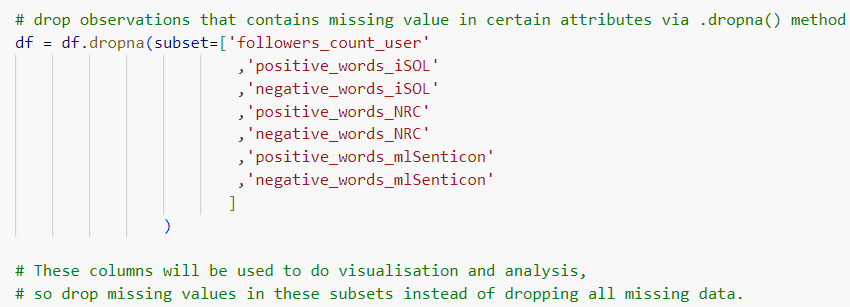

```{python}
#| eval: false
#| code-summary: 'Environment & Versions'
python==3.12
pandas==2.2.2
matplotlib==3.9.x
seaborn==0.13.2
```

# Introduction

This project uses a data set consisting of tweets about the Catalan referendum in Spain on Twitter, with attributes including basic information and emotional word counts of each tweet detected by different lexicons (Jiménez-Zafra et al., 2021) (refer to Appendix I for further description of attributes). A bar plot addresses performance differences between lexicons in detecting sentiment among tweets. In addition, the distribution of the author’s popularity among all tweets is illustrated by a histogram, distinguished by sentiments.

```{python}
# Import libraries
import pandas as pd   # data manipulation
import matplotlib.pyplot as plt   # plotting
import seaborn as sns   # plotting

# Load CSV
df = pd.read_csv(
    './Catalan_Referendum_Twitter_corpus.csv',
    encoding = 'latin',  # non-utf-8 encoding
    delimiter = ';',
)

# Preview data
df.head()
```

# Overall Data Processing

```{python}
## Drop missing values (see Appendix II)
df = df.dropna()

## Sample 1000 rows and reset index
df = df.sample(1000, random_state = 32).reset_index(drop = True)

## Rename columns for readability
# 1) unify favorite/favourites spelling
# 2) clarify statuses_count_user
df = df.rename(
    columns = {
        'favorite_count':'like_count',
        'favourites_count_user':'likes_count_user',
        'statuses_count_user':'tweets_count_user',
    }
)
```

## Setting Count Attributes

```{python}
# Inspect attribute datatypes
df.info()
```

{fig-alt="Figure 1. Datatypes and Attributes"}

```{python}
#| results: 'hold'
## Check dtypes of 3 object-type count attributes
print(df[['retweet_count', 'num_urls', 'positive_words_mlSenticon']].dtypes)

print("")

## Confirm all values are numeric strings (safe to cast with .astype())
print(
    df['retweet_count'].str.isnumeric().all(),
    df['num_urls'].str.isnumeric().all(),
    df['positive_words_mlSenticon'].str.isnumeric().all()
)

## Cast all count attributes to int
# object -> int
df[[
    'retweet_count', 'num_urls', 'positive_words_mlSenticon',
]] = df[[
    'retweet_count', 'num_urls', 'positive_words_mlSenticon',
]].astype(int)

# float -> int
float_cols = df.select_dtypes(include='float').columns  # all float columns
df[float_cols] = df[float_cols].astype(int)
```

## Setting Boolean Attributes

```{python}
#| results: 'hold'
# Confirm bool columns only contain 'True'/'False' strings
print(df['is_quote_status'].unique())
print(df['verified_user'].unique())

# Cast string bool columns to bool
df['is_quote_status']=df['is_quote_status'].map({'True':True, 'False':False})
df['verified_user']=df['verified_user'].map({'True':True, 'False':False})
```

# Data Visualisation

## Sentiment Distribution

```{python}
## Melt sentiment word count columns to long format for visualisation
# value_vars: all sentiment count columns (positive/negative for each lexicon)
# var_name: stores original column name (encodes sentiment and source)
# value_name: stores the corresponding count
df_melted = df.melt(
    value_vars = [
        'positive_words_iSOL','negative_words_iSOL',
        'positive_words_NRC','negative_words_NRC',
        'positive_words_mlSenticon','negative_words_mlSenticon',
    ],
    var_name = 'sentiment_and_source',
    value_name = 'count',
)

df_melted.head()  # initial melt result, before further processing
```

```{python}
## Add sentiment column (positive/negative)

# each returns a boolean Series checking 
# if sentiment_and_source contains the keyword
is_positive = df_melted['sentiment_and_source'].str.contains('positive')
is_negative = df_melted['sentiment_and_source'].str.contains('negative')

# assign 'positive'/'negative' to the new sentiment column by index
df_melted.loc[df_melted[is_positive].index,'sentiment'] = 'positive'
df_melted.loc[df_melted[is_negative].index,'sentiment'] = 'negative'

## Add source column (lexicon name)
is_iSOL = df_melted['sentiment_and_source'].str.contains('iSOL')
is_NRC = df_melted['sentiment_and_source'].str.contains('NRC')
is_mlSenticon = df_melted['sentiment_and_source'].str.contains('mlSenticon')
df_melted.loc[df_melted[is_iSOL].index,'source'] = 'iSOL'
df_melted.loc[df_melted[is_NRC].index,'source'] = 'NRC'
df_melted.loc[df_melted[is_mlSenticon].index,'source'] = 'mlSenticon'

## Drop the now-redundant sentiment_and_source column
df_melted = df_melted.drop(columns = 'sentiment_and_source')
df_melted.head()  # sentiment and source are now separate columns

##############################################################################
## Set seaborn theme and plot bar chart

sns.set_theme(font = 'Arial', font_scale = 1.2, style = 'whitegrid')

sns.barplot(
    data = df_melted, x = 'source', y = 'count', hue = 'sentiment', 
    # palette: salmon (warm) for positive, royalblue (cool) for negative
    palette = ['salmon', 'royalblue'], errorbar = None,
)
plt.title('Online Sentiment towards the Catalan Referendum')
plt.ylim(0, 0.6)  # set y-axis range
plt.xlabel('Emotion Analysis Lexicon')
plt.ylabel('Average Emotional Word Count')
plt.legend(title = 'Sentiment')
plt.show()
```

[Figure 2. Online Sentiment towards the Catalan Referendum]{.caption}

Figure 2 presents the average counts of emotional words detected from the selected tweets about the Catalan referendum, divided by three emotion analysis lexicons: iSOL, NRC, and mlSenticon. Positive and negative sentiments are distinguished by different colours, where a warm red colour ‘salmon’ is assigned to positive ones and a cool blue colour ‘royalblue’ to negative ones, which are two predefined colours in Matplotlib (List of named colors — Matplotlib 3.9.2 documentation, no date, sec. CSS Colors). They are moderate in saturation and intensity, avoiding eye strain of audiences (Wilke, 2019, chap. 19.1). Additionally, the colour assignment is intuitive because their temperature tendency typically corresponds to their allocated sentiments (Hanada, 2018), enhancing the ‘data-ink ratio’ of this plot (Wilke, 2019, chap. 23).

Overall, the number of negative words consistently exceeds that of positive ones, reflecting the relatively negative online public attitude towards the Catalan referendum.

Regarding the performance of each lexicon, NRC possibly has the most balanced performance in determining the emotional tendency of discourse reflected by the bar chart. Conversely, mlSenticon is likely less effective in this work, inferred from its lowest figure for both sentiments.

## Popularity Distribution

The formula below is introduced to calculate the *popularity* (Riquelme and González-Cantergiani, 2016, pp. 6, 11) of tweet authors:

$$Popularity(i) = 1 - e^{-λ·Fi} $$

*Popularity* indicates how popular a user could be, where *e* is the base of the natural logarithm, λ is a constant. The introduction of *popularity* aims to create an attribute storing ratio data reasonably distributed in histograms, since the original ratio attributes (e.g. follower count) seem too scattered to view.

```{python}
## Define popularity calculation function
# F1: author follower count; e ≈ 2.718, λ = 0.001
def calc_popularity(F1):
    result = 1 - 2.718 ** (-0.001*F1)
    return result

## Add popularity column
# apply calc_popularity row-wise to followers_count_user
df['popularity'] = df['followers_count_user'].apply(calc_popularity)

## Define overall_sentiment function (based on iSOL lexicon)
def determ_sentiment(row):
    if row['positive_words_iSOL'] > row['negative_words_iSOL']:
        return 'positive'
    elif row['positive_words_iSOL'] < row['negative_words_iSOL']:
        return 'negative'
    else:
        return 'neutral'

## Add overall_sentiment column
# axis=1: apply function row-wise
df['overall_sentiment'] = df.apply(determ_sentiment, axis=1)

## Plot author popularity distribution histogram
ax = sns.histplot(
    data = df, x = 'popularity',
    hue = 'overall_sentiment',
    hue_order = ['neutral', 'positive', 'negative'],
    # palette: colors map intuitively to sentiment
    palette = ['lightgray', 'salmon', 'royalblue'],
    multiple = 'stack',  # stack groups
    alpha = 0.9  # transparency
)

# update legend title (see Appendix III)
ax.get_legend().set_title('Overall Sentiment')
plt.title('Author Popularity Distribution Histogram')
plt.xlabel('Author Popularity')
plt.ylabel('Tweet Count')
plt.ylim((0, 300))  # set y-axis range
plt.show()
```

[Figure 3. Author Popularity Distribution Histogram]{.caption}

Figure 3 shows the distribution of author *popularity* among tweets, grouped by sentiments. Overall, most participants are at the lowest levels of *popularity*, and the number of tweets gradually decreases with the author *popularity* increasing, until the figure for *popularity* reaches its highest levels. Moreover, the majority of tweets are neutral, while negative contributions are more prevalent than positive ones.

# Reflection

These two plots only analyse a limited number of attributes in the dataset, where there is room for improvement. Other attributes could have also been employed in visualisation since their data types have been processed. For instance, basic information attributes such as retweet count and like count can be used to estimate the engagement of each tweet, with a histogram as visualisation.

# Conclusion

This project analyses the overall online attitude towards the Catalan referendum and compares three lexicons' performance by a bar plot, where the public attitude tends to be negative, and the NRC lexicon seems the most balanced. Additionally, users with lower *popularity* contributed the most presented by a histogram showing the distribution of user *popularity* divided by the attitude orientation of each tweet.

# References

Hanada, M. (2018) ‘Correspondence analysis of color–emotion associations’, *Color Research & Application*, 43(2), pp. 224–237. Available at: <https://doi.org/10.1002/col.22171>.

Jiménez-Zafra, S.M. et al. (2021) ‘Catalan Referendum Twitter corpus’. *Zenodo*. Available at: <https://doi.org/10.5061/dryad.stqjq2c24>.

List of named colors — Matplotlib 3.9.2 documentation (no date). Available at: <https://matplotlib.org/stable/gallery/color/named_colors.html#css-colors> (Accessed: 29 October 2024).

Riquelme, F. and González-Cantergiani, P. (2016) ‘Measuring user influence on Twitter: A survey’, *Information Processing & Management*, 52(5), pp. 949–975. Available at: <https://doi.org/10.1016/j.ipm.2016.04.003>.

Wilke, C.O. (2019) *Fundamentals of Data Visualization: A Primer on Making Informative and Compelling Figures.* Sebastopol: O’Reilly Media, Inc. Available at: <https://clauswilke.com/dataviz/> (Accessed: 29 October 2024).

# Appendix I: Description of Attributes

Below is the overall instruction of [the original dataset](https://zenodo.org/records/4750661) and description of each attribute offered by the dataset provider.

> This corpus consists of 46,962 tweets related to the Catalan referendum, a very controversial topic in Spain due to it was an independence referendum called by the Catalan regional government and suspended by the Constitutional Court of Spain after a request from the Spanish government. All the tweets were downloaded on October 1, 2017 with the hashtags #CatalanReferendum or #ReferendumCatalan. Later, we collected features of these tweets on October 31, 2017 in order to analyze their virality. Each item in this collection is made up of the features we used from each tweet to perform the virality analysis.

## Tweet Metadata Attributes

| Attribute | Description |
|-----------|-------------|
| `lang` | Tweet language |
| `retweet_count` | Total number of retweets recorded for a given tweet. |
| `favourite_count`<br>(renamed as `like_count`) | Total number of favourites recorded for a given tweet. |
| `is_quote_status` | Whether a tweet includes a quote of another tweet. |
| `num_hashtags` | Total number of hashtags in the tweet. |
| `num_urls` | Total number of URLs in the tweet. |
| `num_mentions` | Total number of users mentioned in the tweet. |
| `interval_time` | Interval of the day on which the tweet was published (morning 06:00–12:00, afternoon 12:00–18:00, evening 18:00–00:00, or night 00:00–06:00). |

## Emotional Word Count Attributes

| Attribute | Description |
|-----------|-------------|
| `positive_words_iSOL` | Total number of positive words found in the tweet using iSOL lexicon. |
| `negative_words_iSOL` | Total number of negative words found in the tweet using iSOL lexicon. |
| `positive_words_NRC` | Total number of positive words found in the tweet using NRC lexicon. |
| `negative_words_NRC` | Total number of negative words found in the tweet using NRC lexicon. |
| `positive_words_mlSenticon` | Total number of positive words found in the tweet using ML-SentiCon lexicon. |
| `negative_words_mlSenticon` | Total number of negative words found in the tweet using ML-SentiCon lexicon. |

## Author Metadata Attributes

| Attribute | Description |
|-----------|-------------|
| `verified_user` | Whether the tweet is from a verified user. |
| `followers_count_user` | Total number of users who follow the author of a tweet. |
| `friends_count_user` | Total number of friends that the author is following. |
| `listed_count_user` | Total number of lists that include the author of a tweet. |
| `favourites_count_user`<br>(renamed as `likes_count_user`) | Total number of favourited tweets by a user. |
| `statuses_count_user`<br>(renamed as `tweets_count_user`) | Total number of tweets made by the author since the creation of the account. |

# Appendix II: Validating Values Before Modifying Data Types

In the beginning, only missing data of certain subsets were dropped via `.dropna()` method.

{fig-alt="Dropping NAs from certain columns only"}

However, errors occurred subsequently when modifying data types via `.astype()` method.

"){fig-alt="Error when using .astype(int)"}

It was because the strings in those attributes were not all numerical, in which case the strings cannot be directly changed into integers via `.astype(int)`.

{fig-alt="Check non-numerical strings"}

Therefore, it is necessary to check if all strings are numerical before applying methods to change the data type. Moreover, it was found that if all missing values were dropped initially via simply `.dropna()` (no keyword arguments), the probability of not returning errors would significantly increase.

# Appendix III: Modifying Seaborn Histograms' Legend

Figure 3 (histogram of author *popularity*) was plotted via the seaborn function `.histplot()`, grouped in colours by defining the *hue* parameter. By this means, the legend was automatically generated, with the column label ‘overall_sentiment’ as the title. However, it does not make much sense as a title. The `plt.legend()` was thus employed aiming at changing the legend title and maintaining all other information. Nevertheless, it did not work perfectly with the legend as shown below. It is supposed that the error might be because there were conflicts between the legend automatically generated by Seaborn and the manually added legend via `plt.legend()` function.

{fig-alt="First Attempt"}

Therefore, the `plt.legend()` argument was changed into the `ax.get_legend().set_title()` argument, which detected the generated legend in this plot, and then set a new title to it.