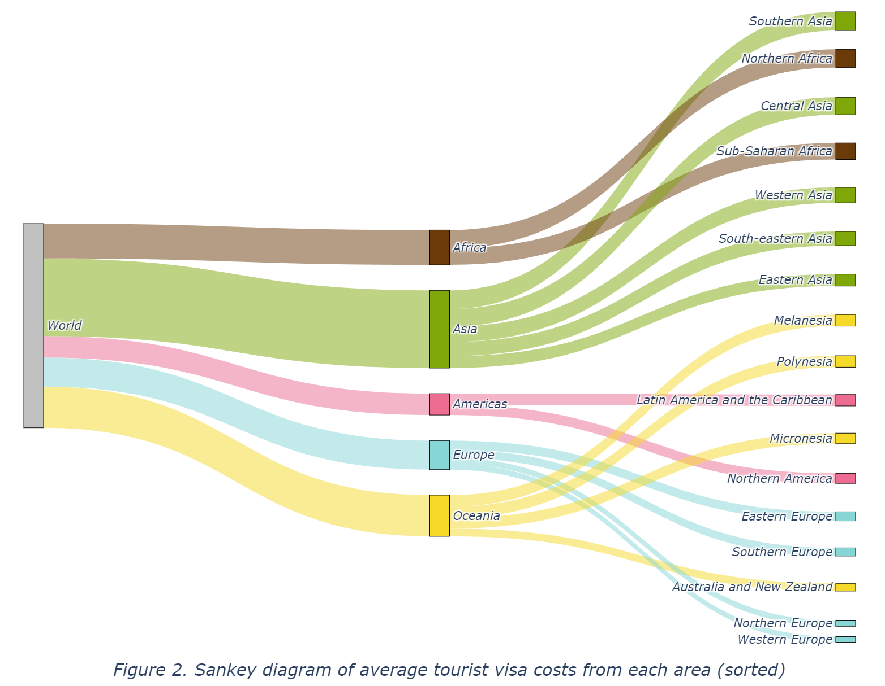

```{python}
#| eval: false
#| code-summary: 'Environment & Versions'
python==3.12
pandas==2.2.2
matplotlib==3.9.x
plotly==5.24.1
```


# Introduction

This project uses the Global Visa Cost Dataset (Recchi et al., 2020) created by researchers from the European University Institute's Migration Policy Centre, which provides detailed information on visa costs between country pairs for seven categories in 2019 (see Appendix for further explanation). Data was primarily collected manually from governmental websites. Three types of interactive graphs – Sankey diagram, bar chart, and choropleth – will be employed to visualize data in the following sections.

```{python}
import pandas as pd  # to deal with DataFrames

# Defining path to the dataset file and reading in the dataset
path = "./GMP_GlobalVisaCostDataset_version1.1.csv"
df = pd.read_csv(path, delimiter='\t') # read in tab separated CSV file

#【delimiter】
# This parameter determines the separator used to interpret the in CSV file, 
# where '\t' denotes a tab character (Pandas, 2024e).
```

# Data Visualization and Analysis

## Sankey Diagram

### Cleaning DataFrame

```{python}
## Defining a new variable df0 to store DataFrame without missing data 
# in the specified columns, to ensure that the sankey diagram will 
# only contain valid nodes.

df0 = df.dropna(
    subset=[
        'tourist_visa',
        'source',
        'source_region',
        'source_subregion',
    ]
)

#【.dropna()】
# This method drops rows with any missing values (Pandas, 2024b).

#【subset】
# This parameter specifies which columns to consider when removing rows with 
# missing values. In this case, these are the columns to be used for 
# creating sankey diagram.

# For convenience, this project will only use data about tourist visa, 
# as the most common type of visa (Recchi et al., 2021, p. 7).
```

### Defining Nodes

```{python}
##############################################################################
## Defining lists to store labels for nodes
source_region_labels = list(df0['source_region'].unique())
source_subregion_labels = list(df0['source_subregion'].unique())

#【.unique()】
# This method returns an Array object containing a list of unique values 
# from a Series object (Pandas, 2024f). In this case, the columns 
# 'source_region' and 'source_subregion' in the DataFrame df0 serve as 
# the Series objects, where missing values are already dropped via 
# .dropna() method. Subsequently, .unique() method is used to return 
# Array objects containing lists of unique values from each column. 
# These values will be used to create node labels. 

#【list()】
# This built-in Python function (also class) converts the input to 
# a list (Python, 2024a). In this case, it is used to convert the 
# Array objects mentioned above into Python list objects.

##############################################################################
## Combining lists to define an entire list storing all node labels
node_labels = ['World'] + source_region_labels + source_subregion_labels

#【+】
# This operator concatenates two or more sequences (e.g., lists) 
# into a single sequence (Python, 2024b). In this case, it is used 
# to combine lists of node labels into a single list.

#【'World'】
# 'World' is added to the start of the list, serving as the root node label.

##############################################################################
## Defining an an iterable range object to store the index for each node
node_ids = range(len(node_labels))

#【len()】
# This built-in Python function returns the number of items in an object 
# (i.e., the length of an object), which can be a sequence (e.g., list) 
# or a collection (e.g., dictionary) (Python, 2024a). In this case, 
# it is used to return the length of the list node_labels storing 
# all node labels, which equals to 23.

#【range()】
# This built-in Python function (also class) returns a sequence of numbers, 
# starting from zero by default (Python, 2024a). In this case, 
# range(23) starts from 0 to 22, which equal to the indices of items 
# in the list node_labels.

##############################################################################
## Defining a dictionary to store the label and index for each node
nodes = dict(zip(node_labels, node_ids))

#【zip()】
# This built-in Python function iterate over several iterables in parallel, 
# producing tuples with an item from each one (Python, 2024a).

#【dict()】
# This built-in Python function (also class) creates a dictionary from 
# two or more sequences (Python, 2024a). In this case, it is used 
# to create a dictionary where the keys are node labels 
# and values are the indices of node labels.
```

### Defining Links

```{python}
##############################################################################
## Creating an aggregated DataFrame to store relevant data, which will be used 
# to calculate the value of link towards each subregion.
to_subregion_value = df0.groupby('source_subregion').agg(
    {
    'source_region':'first', # the region of each subregion 
    'tourist_visa':'mean', # mean of tourist visa cost in each subregion
    }
)

#【.groupby()】
# This method is used to group rows of df0 based on the column 'source_region'.

#【.agg()】
# This method is used to calculate the aggregation of values in each group.

#【'first'】
# This aggregation function returns the first entry of each column within 
# each group in the DataFrameGroupBy object (Pandas, 2024a). 
# In this case, it is used to select the first region encountered 
# in each group of subregions (i.e., the region for each subregion).

##############################################################################
## Creating an aggregated DataFrame to store values of link towards each region.
to_region_value = (
    to_subregion_value
    .groupby('source_region')
    .agg({'tourist_visa':'sum'})
)

##############################################################################
## Creating empty lists to store the source, source, and value for each link
sources = [] # to be filled with the indices of node labels of source nodes
targets = [] # to be filled with the indices of node labels of target nodes
values = [] # to be filled with the values for each link (tourist_visa)

## From 'World' to regions
for region in source_region_labels:

    # Append 'World' as the source nodes
    sources.append(nodes['World'])

    # Append each region as the target nodes
    targets.append(nodes[region])

    # Append values in df0_agg1 for each region as the value for each link
    values.append(to_region_value.loc[region,'tourist_visa'])

## From regions to subregions
for subregion in source_subregion_labels:

    # Append each corresponding region as the source nodes
    # get the corresponding region
    region = to_subregion_value.loc[subregion,'source_region']
    sources.append(nodes[region])

    # Append each subregion as the target nodes
    targets.append(nodes[subregion]) 
    
    # Append values in df0_agg2 for each subregion as the value for each link
    values.append(to_subregion_value.loc[subregion,'tourist_visa'])
```

### Assigning Colors

```{python}
source_region_labels # Checking regions in df0
```

```{python}
##############################################################################
## Defining a dictionary to store region colors

region_colors = {
    'Africa': '#6B3A09',  # Brown
    'Asia': '#7FA709',  # Green
    'Americas': '#EC6C92', # Pink
    'Oceania': '#F5DA29',  # Yellow
    'Europe': '#85D6D5',  # Blue
}

# These colors are generated (in hex) via Nichols's (no date) 
# color palette generator for better visibility to color blind people.

##############################################################################
## Defining node colors based on regions

node_colors = []  # Creating an empty list to store node colors

# Using for loop to append node colors to the list
for label in node_labels:
    if label in source_region_labels:
        node_colors.append(region_colors[label])
    
    elif label in source_subregion_labels:
        # get the corresponding region
        region = to_subregion_value.loc[label,'source_region']
        node_colors.append(region_colors[region])

    else: # if label is 'World'  
        node_colors.append('silver') 

##############################################################################
## Define link colors with transparency
import matplotlib.colors as c  # to create faint colors in RGBA format

## Defining strings to store faint colors for links in RGBA format
faint_Africa = 'rgba'+str(c.to_rgba(region_colors['Africa'], 0.5)) 
faint_Asia = 'rgba'+str(c.to_rgba(region_colors['Asia'], 0.5)) 
faint_Americas = 'rgba'+str(c.to_rgba(region_colors['Americas'], 0.5)) 
faint_Oceania = 'rgba'+str(c.to_rgba(region_colors['Oceania'], 0.5)) 
faint_Europe = 'rgba'+str(c.to_rgba(region_colors['Europe'], 0.5))

# 0.5: alpha=0.5, means 50% transparency of colors

##############################################################################
## Defining a dictionary to store faint link colors based on regions
faint_region_colors = {
    'Africa': faint_Africa,  # faint brown
    'Asia': faint_Asia,  # faint green
    'Americas': faint_Americas,  # faint pink
    'Oceania': faint_Oceania,  # faint yellow
    'Europe': faint_Europe,  # faint blue
}

##############################################################################
## Defining link colors based on regions
link_colors = []  # Creating an empty list to store link colors

# Using for loop to append link colors to the list
for source, target in zip(sources, targets):
    if node_labels[source] in source_region_labels:
        link_colors.append(faint_region_colors[node_labels[source]])
    
    elif node_labels[target] in source_region_labels:
        link_colors.append(faint_region_colors[node_labels[target]])

##############################################################################
# Check if the number of node colors matches the number of nodes
print(len(node_colors) == len(nodes))

# Check if the number of link colors matches the number of links
print(len(link_colors) == len(sources) == len(targets) == len(values))
```


### Creating Sankey Diagram

```{python}
##############################################################################
import plotly.graph_objects as go  # to create sankey diagram

## Creating a Sankey object to store sankey data via go.Sankey() function

sankey_data = go.Sankey(   # defining a variable to store sankey data
    # defining nodes
    node = dict(
        label = node_labels,  # labels for nodes
        color = node_colors,  # colors for nodes
        pad = 30,  # the horizontal distance between nodes
        thickness = 20,  # thickness of nodes
        line = {'color':'black','width':0.5},  # style for node outlines
    ),

    # defining links
    link = dict(
        source = sources,  # indices of source nodes in node_labels
        target = targets,  # indices of target nodes in node_labels
        value = values,  # values for links
        color = link_colors, # colors for links
    )
)

##############################################################################
# Creating a Figure object to store sankey data via go.Figure() function
fig1 = go.Figure(sankey_data)

# Updating layout of the figure
fig1.update_layout(
    # width = 800, height = 600,
    margin = dict(t = 60, b = 10),  # margin top & bottom
    title_text = '''
        Sankey diagram of average tourist visa costs from each area
    ''',
    title_x = 0.5, title_y = 0.95,  # location of the title
    font = {'style':'italic'},      # font style of the figure
) 
    #【.update_layout()】
    # This method is used to update the layout of the figure, 
    # including the size, title, font, etc. (Plotly, 2024b).

fig1.show(config = {"responsive": True})      # display the sankey diagram

    #【renderer】
    # This parameter is used to specify the renderer used to render 
    # the figure (Plotly, 2024b), and 'notebook' refers to Jupyter notebook.

    # This project is edited and exported to HTML file using 
    # Visual Studio Code with Jupyter extensions, in which case 
    # renderer='notebook' is effective for diagram display within 
    # Visual Studio Code and the exported HTML file. However, 
    # this argument seems not working for diagram display within output 
    # cells using Jupyter (but working for exported HTML file).
```

[Figure 1. Sankey diagram of average tourist visa costs from each area]{.caption}

As shown above, Figure 1 illustrates the distribution of average tourist visa costs from global regions (e.g., Asia, Europe, Africa) to their corresponding subregions (e.g., Eastern Asia, Northern Europe). The width of the links from regions to subregions represents the average tourist visa cost per country (as countries of origin) in each subregion, while the widths of the links on the left-hand side (from the ‘World’ node to each region node) are the sum of their corresponding links towards the subregions. Overall, this Sankey diagram (Figure 1) shows the flow of global tourist visa costs.

{fig-alt="Figure 2"}

Moreover, Figure 2 provides the same Sankey diagram with manually sorted subregion nodes by their links’ values (average tourist visa costs), which could be of better interpretation for gaps between areas in tourist visa costs. As shown in Figure 2, subregions belonging to Asia and Africa exhibit significantly larger flows, indicating their higher overall tourist visa cost. In contrast, smaller flows can be seen in Europe, Australia and New Zealand, and Northern America, reflecting their lower average tourist visa costs. Meanwhile, within Asia, the Southern Asia area has the highest figure whereas Eastern Asia has the lowest. Likewise, Western Europe has the lowest figure among all European areas.

In general, Figures 1 and 2 reveal potential inequality between countries in different areas regarding the ability to leave their country. This gap will be further demonstrated in the following sections on the bar chart (Figures 3 and 4).

## Bar Chart

### Aggregating Data

```{python}
import plotly.express as px  # to create plotly interactive graphs
```

```{python}
# Aggregating data in order to draw the bar chart

bar_agg = df.groupby('source_subregion').agg(
    {
    'source_region':'first', # region of each subregion
    'tourist_visa':'mean',   # average tourist visa cost
    'tourist_perdailyincome':'mean', # average tourist visa cost per daily income
    }
).reset_index()  # resetting index to make 'source_subregion' a regular column

#【.reset_index()】
# This method is used to reset the index of the aggregated DataFrame, 
# placing all columns into a single level index (Pandas, 2024c). 
# Namely, transform the automatically generated index ('source_subregion') 
# into a regular column.
```

### Creating Bar Chart

```{python}
# Creating a bar chart to show average tourist visa cost in each subregion

fig2 = px.bar(
    bar_agg, x = 'tourist_visa', y = 'source_subregion',
    labels = {  # assigning x and y labels 
        'tourist_visa':'Average tourist visa cost ($)',  
        'source_subregion':'Subregion',
    },
    color = 'source_region',  # grouping bars by region in different colors
    color_discrete_map = region_colors  # assigning colors (previously defined)
)

# Updating layout properties of the figure
fig2.update_layout(
    # width=800, height=480,
    margin = dict(t = 90, b = 10),    # margin top & bottom
    title_text='Average tourist visa costs per subregion',
    title_x = 0.5, title_y = 0.95,    # location of the title
    titlefont = {'style': 'italic'},  # font style of the title
    yaxis = {'categoryorder': 'total ascending'}, # sort by values ascending
    legend = {
        'title':'Region',
        'orientation': 'h',  # horizontal oriented legend
        'xanchor': 'right',
        'yanchor': 'bottom', 
        'x': 1, 'y': 1,
    },
) 

fig2.show(config = {"responsive": True}) # displaying the figure
```

[Figure 3. Bar chart of average tourist visa costs from each subregion]{.caption}

Figure 3 presents the same data as in Figure 1 and Figure 2, which is the average tourist visa costs from each area (only subregions in Figure 3), grouped by region in different colors, while the bar chart (Figure 3) can show the difference in value more clearly as compared to Figure 2 since the length in Figure 3 (bar chart) are more distinguishable than the width of links in Figure 1, which is also in line with Wilke’s (Wilke, 2019, chap. 6) suggestion that bar chart could be more suitable for presenting variations in amount of value. It may be inferred from Figures 1, 2 and 3, that people in countries in well-developed areas (e.g., Western Europe) have to pay less to go abroad whereas those in underdeveloped countries in areas such as Southern Asia and Northern Africa should pay more to go abroad. Nevertheless, another variable ‘tourist_perdailyincome’ (see Appendix for detailed description) is introduced to calculate the underlying *actual* data on the level of tourist visa costs when adjusted by the average daily income in each country (Recchi et al., 2021, p. 4).

```{python}
# Creating a bar chart to show average tourist visa cost per daily income 
# in each subregion, namely, the average working days to afford a 
# tourist visa from countries in each subregion.

fig3 = px.bar(
    bar_agg, x = 'tourist_perdailyincome', y = 'source_subregion',
    labels = dict( # assigning x and y labels
        tourist_perdailyincome = '''
            Average working days to afford tourist visa (day)
        ''', 
        source_subregion = 'Subregion',
    ),
    color = 'source_region', # grouping by region in different colors
    color_discrete_map = region_colors # assigning colors (previously defined)
)

# Updating layout properties of the figure
fig3.update_layout(
    # width=800, height=480,
    margin = dict(t = 90, b = 10),    # margin top & bottom
    title_text='''
        Average working days to afford tourist visa per subregion
    ''',
    title_x = 0.5, title_y = 0.95,    # location of the title
    titlefont = {'style': 'italic'},  # font style of the title
    yaxis = {'categoryorder': 'total ascending'}, # sort by values ascending
    legend = {
        'title':'Region',
        'orientation': 'h',  # horizontal oriented legend
        'xanchor': 'right',
        'yanchor': 'bottom', 
        'x': 1, 'y': 1,
    },
) 

fig3.show(config = {"responsive": True}) # displaying the figure
```

[Figure 4. Average working days to afford tourist visa per subregion]{.caption}

As shown in Figure 4, there are even more significant gaps between areas regarding their income-adjusted average tourist visa costs (i.e., average working days to afford a tourist visa), revealing a paradoxical global situation – the poorer a country, the more citizens in it should pay for tourist visas to go abroad.

## Choropleth

### Aggregating Data

```{python}
# Aggregating data in order to draw the choropleth
choro_agg = (
    df.groupby('source')
    .agg({
        'source_iso3': 'first',
        'tourist_visa': 'mean',
    })
    .sort_values('tourist_visa', ascending=False)
    .reset_index()
)

#【.sort_values()】
# This method is used to sort the aggregated DataFrame by 'tourist_visa' 
# column, in descending order (ascending=False) (Pandas, 2024d).

#【.reset_index()】
# resetting index to make 'source_iso3' a regular column
```

### Creating Choropleth

```{python}
# Creating a choropleth map to show average tourist visa cost in each country
fig4 = px.choropleth(
    choro_agg, 
    locations = 'source_iso3', # region identifiers for locations
    locationmode = 'ISO-3', # country codes
    color = 'tourist_visa', # map color by tourist visa costs
    hover_name = 'source', # hover: region name
    hover_data = 'tourist_visa', # hover: data
    color_continuous_scale = 'aggrnyl', # color scale for the choropleth
)

# Updating layout properties of the figure
fig4.update_layout(
    # width = 800, height = 500,
    title = 'Choropleth map of average tourist visa costs',
    margin = dict(t = 50, b = 0),
    title_x = 0.5, title_y = 0.95,  # location of the title
    title_font = {'style':'italic'},  # font style of the title
    coloraxis = dict(
        colorbar = dict(  # specify colorbar properties
            orientation = 'h',  # orientation of the colorbar: horizontal
            title = 'Average tourist visa cost ($)', # title of the colorbar
            xanchor = 'right', x = 1,
            yanchor = 'top', y = 1,
            len = 0.8, thickness = 16,  # length and thickness of the colorbar
        ),
    ),
)

fig4.show(config = {"responsive": True}) # displaying the figure
```

[Figure 5. Choropleth map of average tourist visa costs]{.caption}

Furthermore, we may gain insights by moving from the sub-region level to the country level. Figure 5 provides information about the distribution of average tourist visa costs in specific countries around the world, which varies with the continuous color indicator. According to Wilke (2019, p. 173), as for choropleth, it is typically accepted that dark-colored background areas in the maps behave better in visibility than light-colored background areas for webpages. Figure 5 thus employs a color map with dark-colored background areas, where the color gradually fades with the value increasing (Plotly, 2024a).

# Reflection and Possible Improvements

There is still space for improvement in this project. For instance, it only discussed one category of visa – tourist visa. Other types of visas could be included to gain more insights into nuanced variation. In addition, the color bar of the choropleth (Figure 5) may be refined by binned continuous color scales, because continuous color scales seem not easy to recognise specific color values and match them with areas in the map (Wilke, 2019, pp. 174–175).

# Conclusion

In conclusion, this project visualizes and analyses data about global tourist visa costs in different areas, revealing the paradoxical situation that the richer a country, the less tourist fee nationals in it need to pay to go abroad.

# References

Nichols, D. (no date) *Coloring for Colorblindness*. Available at: <https://davidmathlogic.com/colorblind/> (Accessed: 11 December 2024)

Pandas (2024a) *pandas.core.groupby.DataFrameGroupBy.first*. Available at: [pandas](https://pandas.pydata.org/docs/reference/api/pandas.core.groupby.DataFrameGroupBy.first.html#pandas.core.groupby.DataFrameGroupBy.first) (Accessed: 12 December 2024)

Pandas (2024b) *pandas.DataFrame.dropna*. Available at: [pandas](https://pandas.pydata.org/docs/reference/api/pandas.DataFrame.dropna.html) (Accessed: 11 December 2024)

Pandas (2024c) *pandas.DataFrame.reset_index*. Available at: [pandas](https://pandas.pydata.org/docs/reference/api/pandas.DataFrame.reset_index.html) (Accessed: 11 December 2024)
Pandas (2024d) *pandas.DataFrame.sort_values*. Available at: [pandas](https://pandas.pydata.org/docs/reference/api/pandas.DataFrame.sort_values.html#pandas.DataFrame.sort_values) (Accessed: 12 December 2024)

Pandas (2024e) *pandas.read_csv*. Available at: [pandas](https://pandas.pydata.org/docs/reference/api/pandas.read_csv.html) (Accessed: 10 December 2024)

Pandas (2024f) *pandas.Series.unique*. Available at: [pandas](https://pandas.pydata.org/docs/reference/api/pandas.Series.unique.html) (Accessed: 10 December 2024)

Plotly (2024a) *Built-in Continuous Color Scales in Python*. Available at: [plotly](https://plotly.com/python/builtin-colorscales/)  (Accessed: 13 December 2024)

Plotly (2024b) *plotly.graph_objects.Figure*. Available at: [plotly](https://plotly.com/python-api-reference/generated/plotly.graph_objects.Figure.html#plotly.graph_objects.Figure.show) (Accessed: 10 December 2024)

Python (2024a) *Built-in Functions*. Available at: [python](https://docs.python.org/3/library/functions.html) (Accessed: 10 December 2024)

Python (2024b) *operator — Standard operators as functions*. Available at: [python](https://docs.python.org/3/library/operator.html) (Accessed: 10 December 2024)

Recchi, E. et al. (2020) ‘Global Visa Cost Dataset’. Available at: <https://doi.org/10.5281/zenodo.4572529>

Recchi, E. et al. (2021) ‘The global visa cost divide: How and why the price for travel permits varies worldwide’, *Political Geography*, 86(4). Available at: <https://doi.org/10.1016/j.polgeo.2021.102350>

Wilke, C.O. (2019) *Fundamentals of Data Visualization: A Primer on Making Informative and Compelling Figures*. Sebastopol: O’Reilly Media, Inc.

# Appendix

**This appendix contains additional information about the dataset used in this project (the Global Visa Cost Dataset v1.1), including introduction of the dataset and detailed description of variables.**

## Global Visa Cost Dataset

The Global Visa Cost Dataset, created by researchers from the European University Institute's Migration Policy Centre, provides comprehensive data on visa costs for seven categories between country pairs in 2019. The dataset was developed through manual data collection primarily from official government websites and consulates.

Visa costs are coded in the following categories: tourist, student, business, work, family reunification, transit, and other motives, recorded in US dollars.

For countries where information was not available in English, French, Spanish, Arabic, Italian or Russian, a translation website was used to obtain the necessary information from the primary language of the country.

Several countries, including Palestine and the Syrian Arab Republic, are not coded due to a lack of information about travel access to their territory. Some countries needed a second round of visa cost checks due to difficulties in finding the information about their visa policy and visa requirements. In the case of many country pairs, there is visa policy information but there is no indication of the actual visa costs. For instance, Nauru in Oceania required a particularly engaging search to retrieve an official document on Immigration Regulations of January 2014, where the actual visa categories and costs are mentioned. This information is not indicated in any other official online source. For country pairs where information is not available in the dataset, missing values are introduced.

## Variable Description

### Variables: Countries and Regions

These variables represent the countries and regions of origin and destination, where 'region' refers to the continent a country is located in, and 'subregion' refers to sub-regions within continents.

> **source:** Country of origin\
> **target:** Country of destination\
> **source_iso3:** ISO3 code of country of origin\
> **target_iso3:** ISO3 code of country of destination

> **source_region:** World region country of origin is located in\
> **target_region:** World region country of destination is located in\
> **source_subregion:** World sub-region country of destination is located in\
> **target_subregion:** World sub-region country of destination is located in

*Note: Regions and sub-regions are based on the UN M.49 GeoScheme.*

### Variables: Visa Costs to the Target Countries

These variables are visa costs to the target countries from the source countries based on the official visa policies and visa requirements of the target countries in 2019, measured in US dollars.

> **tourist_visa:** Tourist visa costs (in USD)\
> **student_visa:** Student visa costs (in USD)\
> **business_visa:** Business visa costs (in USD)\
> **work_visa:** Work visa costs (in USD)\
> **family_reunification_visa:** Family reunification visa costs (in USD)\
> **transit_visa:** Transit visa costs (in USD)\
> **other_motives_visa:** Other motives visa costs (in USD)

### Variables: Average Working Days to Pay Visa Costs

These variables estimates how many days people in the source countries have to work on average to be able to afford a visa to the target countries, measured in days.

> **tourist_perdailyincome:** Tourist visa costs (in average daily incomes)\
> **student_perdailyincome:** Student visa costs (in average daily incomes)\
> **business_perdailyincome:** Business visa costs (in average daily incomes)\
> **work_perdailyincome:** Work visa costs (in average daily incomes)\
> **family_perdailyincome:** Family reunification costs (in average daily incomes)\
> **transit_perdailyincome:** Transit visa costs (in average daily incomes)\
> **other_perdailyincome:** Other motives visa costs (in average daily incomes)

*Note: The authors used the GNI per capita as an approximation of the mean income of the average person in a country to calculate what the real costs of visas may be like. Information about GNI per capita are from World Bank (2019), which is available at: https://data.worldbank.org/indicator/NY.GNP.PCAP.CD .*

### Variable: Updates Compared to the Previous Version

This variable indicates updates to the previous version of the dataset.

> **updated:** 1 if value was added/altered in the November 2020 update of the dataset from version 1.0 to version 1.1

*Note: Updates in version 1.1 compared to version 1.0 include corrections, additional data for numerous countries, and a new variable 'updated' to track changes. This project only used the updated version (version 1.1) of the dataset.*