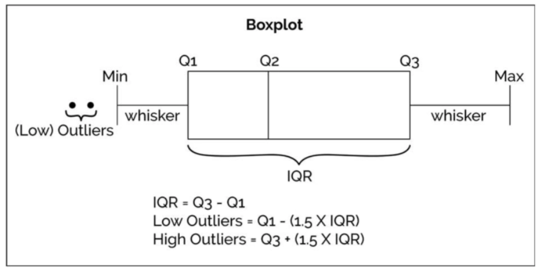

# 1. Seaborn 与 Matplotlib

> **注意：** 本地 VS Code 环境需先安装 Seaborn；Google Colab 已预装，无需安装。

```         
pip install seaborn
```

```{python}
import seaborn as sns  # 导入 Seaborn 库
```

```{python}
import matplotlib.pyplot as plt  # 导入 Matplotlib 库
```

`matplotlib.pyplot` 通常缩写为 `plt`，以便快速调用绘图接口。不推荐使用完整路径：

``` python
    import matplotlib.pyplot     # 从 matplotlib.pyplot 接口导入 Matplotlib 库
    matplotlib.pyplot.plot(略)  # 用 .plot() 函数画图
    matplotlib.pyplot.show()     # 用 .show() 函数展示画好的图表
```

推荐写法：

``` python
    import matplotlib.pyplot as plt # 从 matplotlib.pyplot 接口导入 Matplotlib 库，并给予短称 'plt'
    plt.plot(略)                  # 用 .plot() 函数画图
    plt.show()                      # 用 .show() 函数展示画好的图表
```

- `mpl`：`matplotlib` 的别名，用于全局配置、底层属性及高级子模块（色彩映射、3D 绘图等）。
- `plt`：`matplotlib.pyplot` 的别名，用于快速创建和管理图表，是日常绘图的主要接口。

**参考：[matplotlib.pyplot 教程](https://matplotlib.org/stable/api/pyplot_summary.html)**

```{python}
df = sns.load_dataset('penguins')  # 用 Seaborn 加载一个自带的示例 dataset —— 企鹅 dataset
```

```{python}
df.info()  # show info of df
```

**float 数据**

长度、质量等浮点列为连续数值。有 true zero（0 代表"无"）的为 ratio data（如长度、质量）；无 true zero 的为 interval data（如温度）。

**object 数据**

种类名称（species）、岛名（island）等为 nominal data；性别（sex）为 ordinal data。

```{python}
df.head()  # show the first 5 rows of df
```

```{python}
df.tail()  # show the last 5 rows of df
```

```{python}
df.sample(5)  # show 5 random rows (随机展示五个条目)
```

**注意：函数 (function) vs. 方法 (method)**

`df.info()`、`df.head()`、`df.tail()`、`df.sample()` 均为 DataFrame 对象的**方法**，必须基于具体对象调用，不可独立使用。

`pd.read_csv()` 为 Pandas 预定义的**函数**，可直接调用：

``` python
    df = pd.read_csv('文件路径')   # 读取 csv 文件
```

`df.sample()` 则为对 df 对象操作的方法：

``` python
    df.sample(4)   # 任意选取四行
```

# 2. 绘制柱状图

## 2.1 用 Seaborn 绘制基础柱状图

### 2.1.1 基础柱状图

```{python}
# 用 Seaborn 绘制基础柱状图
sns.barplot(data=df, x='island', y='body_mass_g')  #⭐1
plt.show()

# 👆调用 plt.show() 函数来展示 plot
# 也可以不写 plt.show()，jupyter notebook 或 google colab 会自动展示上面的图表
# 但画的图比较复杂时可能会在 output 里显示很多文字信息，因此最好每次都写 plt.show()

# ⭕【Barchart】
#   用 Seaborn 画 bar chart 时，默认输入的 x 轴值作为 category，y 轴值作为 amount
#   如果对于同一个 category，有多个 amount，则默认取平均值。可以通过修改【estimator参数】来改成别的值。

# ⭕【Error Bar】
#   黑色竖线是 error bar (误差线)。默认 sns.barplot() 函数中的【errorbar参数】 为 errorbar=('ci', 95)
#   意为使用 置信区间 (confidence interval) 公式计算误差 (error)，置信水平为 95% ("有 95% 的把握确定计算得出的结果就是误差区间")。
#   默认 error bar 显示为一条黑线，可以通过设置 errcolor 和 errwidth 等参数来进一步设置 error bar。
```

```{python}
# 更改柱显示值为【总和】（默认为【平均值】）
sns.barplot(data=df, x='island', y='body_mass_g',estimator='sum')

#⭕【estimator参数】
#   默认 estimator='mean'，此处改成了 'sum' 来求每个岛上的企鹅总数

plt.show()
```

**参考：[`sns.barplot()` 函数的用法](https://seaborn.pydata.org/generated/seaborn.barplot.html)**（`estimator` 参数）

```{python}
# 展示你当前使用的 Seaborn 库的版本号
sns.__version__

# Seaborn 0.12 版本中，默认生成 bar chart 是不同颜色的 bar
# 但是这种颜色区分其实是 visual distraction，是 big duck
# 因为通过 x 轴上的名称标签已经可以区分这三个 bar 了，无需再用颜色区分

# 所以 Seaborn 0.13 版本中改进了这一点，全部默认为蓝色 bar
```

```{python}
# 求所有来自【Biscoe岛】的企鹅的【体质量】的平均值
df.loc[(df['island']=='Biscoe'), 'body_mass_g'].mean()

#⭕注意：
#   这个值，即为刚才画的图表中，【Biscoe】bar 在 y轴 上对应的值。
#   因为【Biscoe岛】这个 category 下的【体质量】amount 有多个数值，调用 sns.barplot() 函数画图时默认取了平均值，并显示了误差范围（黑线）。
```

### 2.1.2 Count Plot

```{python}
# 绘制计数图表
sns.countplot(data=df,x='species')

# 不同于 Bar Plot 需要输入两个轴的数据，计数图表只需要输入一个轴的数据，
# 他会自动统计每个 category 出现的次数，作为另一个轴的数据。
# 此处自动统计了 "每个种类的企鹅分别出现的次数"。

plt.show()
```

**参考：[`sns.countplot()` 用法](https://seaborn.pydata.org/generated/seaborn.countplot.html)**

## 2.2 柱分组 & 去除误差线

使用 `hue` 参数按类别分组，设置 `errorbar=None` 去除误差线。

```{python}
# 为了更好地展示信息，我们对 bar 进行分组，并去除 error bar (黑线)
sns.barplot(data=df, x='island', y='body_mass_g',errorbar=('ci',0),hue='sex')  #⭐2
plt.show()

#⭐2 在 ⭐1 的基础上，加入了两句 keyword argument：
# errorbar=('ci', 0) 和 hue='sex'
# 来设置 "误差线" 和 "色相" 两个参数

#⭕【errorbar参数】
#   errorbar=('ci',0) 代表 "按照置信区间 (ci) 计算公式求误差范围，其中置信水平为 0% (即，完全不相信) "，
#   而当置信水平为 0 的时候，置信区间的计算没有意义，没有误差范围。
#   即，没有 error bar。
#⭕【注意1】
#   此处完全可以直接设置 errorbar 参数为 errorbar=None，直接不计算误差范围（即，不显示黑线）。

#⭕【hue参数】
#   hue='sex' 意为用颜色/色相 (hue) 对 df 中的 'sex' attribute (性别列) 进行分组，并自动生成图例 (legend)。
```

**参考：[`sns.barplot()` 函数的用法](https://seaborn.pydata.org/generated/seaborn.barplot.html)**（`errorbar` 参数、`hue` 参数）

## 2.3 旋转刻度标签

x 轴标签过长时，可用 `plt.xticks()` 旋转标签：

```{python}
# 用 Matplotlib 库，让现在 x 轴的刻度标签(数字)分别旋转 45°
sns.barplot(data=df, x='island', y='body_mass_g',errorbar=('ci',0),hue='sex')  #⭐2
plt.xticks(rotation=45, ha='right')

# 【rotation参数】旋转的角度数，默认逆时针旋转。
# 【ha参数】horizontal alignment (水平对齐) 的缩写，ha='right' 意为刻度标签的右端与刻度线对齐。
# 详见链接 plt.xticks() 函数用法中，对于【kwargs】(keyword argument) 栏目的介绍

plt.show()
```

**参考：[`plt.xticks()` 函数用法](https://matplotlib.org/stable/api/_as_gen/matplotlib.pyplot.xticks.html)**（`kwargs` 栏目）

[Wilke (2019, chap. 6.1)](https://clauswilke.com/dataviz/visualizing-amounts.html#bar-plots) 建议：标签密集时，改为横向排版比旋转标签更易读：

```{python}
# 在 ⭐2 的基础上，交换 xy 轴的数据，使表格横过来
sns.barplot(data=df, y='island', x='body_mass_g',errorbar=None,hue='sex')  #⭐3
#⭕注意：
#   xy 轴的 data 交换后，Seaborn 默认让 nominal data (此处为岛的名称)
#   当 category，让 ratio data (此处为体质量) 当 amount；
#   而非仍然默认 x轴 为 category ，y轴 为 amount。

plt.show()
```

同样适用于 Count Plot：

```{python}
# 以上技巧同样适用于 Count Plot
sns.countplot(data=df, y='species', hue='sex')

# 直接让 y轴 当 categories，并根据性别按照颜色分组。
# 此时 x轴 代表 "每种企鹅出现的次数"

plt.show()
```

## 2.4 设置总主题风格

```{python}
# 设置 Seaborn 绘图的总主题风格
sns.set_theme(font_scale=1.2, style='darkgrid')

# 字号 1.2，风格深色带网格。
# ⭕注意：sns.set_theme() 是 Seaborn 的一个全局函数，针对接下来所有用 Seaborn 画的图，而不是仅限于此代码块；
#   而 ax.set() 等方法（下文提到），仅针对 ax 这个具体的图表。
```

`sns.set_theme()` 设置全局绘图主题，作用于之后所有 Seaborn 图表。调用 `sns.reset_orig()` 可恢复默认主题。

```{python}
# 在新主题风格下用 Seaborn 画图
ax = sns.barplot(data=df, y='island', x='body_mass_g',errorbar=None,hue='sex')  #还是⭐3，但定义了变量 ax，为了方便下一行 ax.set() 操作

# 然后，用 Matplotlib 库中的 ax.set() 方法 (method) ，给刚画的图表设置标题、标签等元素
ax.set(title='Penguin', xlabel='Body Mass (g)', ylabel='Island')

plt.show()
```

将 Seaborn 图表赋值给变量 `ax` 后，可调用 Matplotlib 方法进一步修改（类似将 DataFrame 赋值给 `df` 后再调用方法）。

**注意：区分以下两者：**

- `sns.set()` / `sns.set_theme()`：Seaborn **全局**主题设置函数（两者等价，`sns.set_theme()` 为首选）。
- `ax.set()`：Matplotlib 中针对**特定图表对象**的方法，用于设置标题、轴标签等。

**参考：**\
[`sns.set()` 函数](https://seaborn.pydata.org/generated/seaborn.set.html)\
[`sns.set_theme()` 函数](https://seaborn.pydata.org/generated/seaborn.set_theme.html#seaborn.set_theme)\
[`ax.set()` 方法](https://matplotlib.org/stable/api/_as_gen/matplotlib.axes.Axes.set.html)

## 2.5 调整图例

无论 `errorbar=None` 还是 `errorbar=('ci',0)`，图例均可能遮挡图表，需用 `sns.move_legend()` 手动调整位置。

```{python}
# errorbar 不存在
ax = sns.barplot(data=df, y='island', x='body_mass_g',errorbar=None,hue='sex')
ax.set(title='Penguin', xlabel='Body Mass (g)', ylabel='Island')

plt.show()

# ⭕注：error bar 不存在，图例自动生成在右边
```

```{python}
# errorbar 存在，但大小为0
ax = sns.barplot(data=df, y='island', x='body_mass_g',errorbar=('ci',0),hue='sex')
ax.set(title='Penguin', xlabel='Body Mass (g)', ylabel='Island')

plt.show()

#⭕注：error bar 存在但为 0，图例生成时自动避免了遮挡 error bar
```

```{python}
# ⭐3
ax = sns.barplot(data=df, y='island', x='body_mass_g',errorbar=None,hue='sex')
ax.set(title='Penguin', xlabel='Body Mass (g)', ylabel='Island')

# 在 ⭐3 基础上加了一句函数调整图例位置大小
sns.move_legend(ax,bbox_to_anchor=(0.5,-0.2),loc='upper center',ncols=2)

#⭕【obj参数】
#   obj 参数是 sns.move_legend() 函数括号内的第一个参数。
#   它是一个图表对象，作为需要移动图例的源图表对象，此处为 ax。

#⭕【loc参数】
#   Seaborn 中此处的 loc参数 默认可以为 字符串 (str) 或 整数 (int)。
#   默认的字符串有 'upper left' 'upper center' 'down right' 等，
#   让图例自动位于图表的左上角、上部居中、右下角等位置。
#⭕【注意】
#   只设置了 loc参数 而不设置 bbox_to_anchor参数 时，loc 参数 代表 "图例位于整个图表的 XX (e.g. 右上角)"
#   而当同时设置了 loc参数 和 bbox_to_anchor参数 时，loc参数 代表 "图例的 XX (e.g.右上角) 位于整个图表的 (x,y) 位置"

#⭕【bbox_to_anchor参数】
#   用边界框来固定 (use a bound box to anchor the legend)。必须和 loc参数联用。
#   可以设置二元数组 (x,y) 或四元数组 (横坐标,纵坐标,宽度,高度)，此处只用了二元数组。
#   此处 bbox_to_anchor=(0.5,-0.2) 和 loc='upper center' 联用，
#   意为 "让图例的上边缘中点，位于整个图表的 (0.5,-0.2) 位置"。

#⭕【ncols参数】
#   图例的列数 (The number of columns that the legend has)，默认为 1
#   此处只有 male 和 female 两个组，最多分两列。

plt.show()
```

```{python}
# 同上
ax = sns.barplot(data=df, y='island', x='body_mass_g',errorbar=None,hue='sex')
ax.set(title='Penguin', xlabel='Body Mass (g)', ylabel='Island')

# 只设置 loc参数 而不设置 bbox_to_anchor参数
sns.move_legend(ax,loc='lower right')

# 意为 "让图例位于整个图表的右下角"

plt.show()
```

```{python}
# 同上
ax = sns.barplot(data=df, y='island', x='body_mass_g',errorbar=None,hue='sex')
ax.set(title='Penguin', xlabel='Body Mass (g)', ylabel='Island')

# bbox_to_anchor参数 和 loc参数 联用
sns.move_legend(ax,bbox_to_anchor=(1,1),loc='upper left')

# 意为 "让图例的左上角位于整个图表的 (1,1) 位置"

plt.show()
```

**参考：**\
[`sns.move_legend()` 用法](https://seaborn.pydata.org/generated/seaborn.move_legend.html)（`obj` 参数、`loc` 参数）\
[`matplotlib.axes.Axes.legend()` 用法](https://matplotlib.org/stable/api/_as_gen/matplotlib.axes.Axes.legend.html)（`loc`、`ncols`、`bbox_to_anchor` 参数）

## 2.6 修改颜色

使用 `palette` 参数修改图表配色，可传入以下类型的值：

1.  **Seaborn 预定义调色板名称**（默认 `'deep'`）：`'deep'`、`'muted'`、`'bright'`、`'pastel'`、`'dark'`、`'colorblind'`
2.  **Matplotlib Colormap 名称**：如 `'viridis'`、`'plasma'`、`'coolwarm'`、`'Blues'`、`'Reds'`
3.  **HLS/HUSL 颜色模型**：`'hls'`、`'husl'`
4.  **Cubehelix 方案**：`'ch:<args>'`，如 `'ch:s=0.5,r=-0.5'`（色盲友好，支持灰度打印）
5.  **渐变色**：`'light:<color>'`、`'dark:<color>'`
6.  **混合色**：`'blend:<color1>,<color2>'`
7.  **颜色代码列表**：十六进制（`['#FF5733', '#33FF57']`）、RGB 元组、Matplotlib 颜色名称

```{python}
#【⭐4】默认初始 Seaborn 颜色方案
ax = sns.barplot(data=df, y='island', x='body_mass_g',errorbar=None,hue='sex')
ax.set(title='Penguin', xlabel='Body Mass (g)', ylabel='Island')
sns.move_legend(ax,bbox_to_anchor=(1,1),loc='upper left')

plt.show()
```

```{python}
# ⭐4 的基础上，增加了 palette='flare' （'flare' 是 Seaborn 的预设颜色方案名称之一）
ax = sns.barplot(data=df, y='island', x='body_mass_g',errorbar=None,hue='sex', palette='flare')
ax.set(title='Penguin', xlabel='Body Mass (g)', ylabel='Island')
sns.move_legend(ax,bbox_to_anchor=(1,1),loc='upper left')

plt.show()
```

```{python}
# Seaborn 预设颜色名称：'blue' 和 'orange'
ax = sns.barplot(data=df, y='island', x='body_mass_g',errorbar=None,hue='sex', palette=['blue','orange'])
ax.set(title='Penguin', xlabel='Body Mass (g)', ylabel='Island')
sns.move_legend(ax,bbox_to_anchor=(1,1),loc='upper left')

plt.show()
```

```{python}
# 十六进制颜色代码：'#a1c9f4' 和 '#8de5a1'
ax = sns.barplot(data=df, y='island', x='body_mass_g',errorbar=None,hue='sex', palette=['#a1c9f4','#8de5a1'])
ax.set(title='Penguin', xlabel='Body Mass (g)', ylabel='Island')
sns.move_legend(ax,bbox_to_anchor=(1,1),loc='upper left')

plt.show()
```

**参考：**\
[Seaborn `sns.set_theme()` 函数](https://seaborn.pydata.org/generated/seaborn.set_theme.html)（`palette` 参数）\
[Seaborn `sns.color_palette()` 函数](https://seaborn.pydata.org/generated/seaborn.color_palette.html)（预设调色盘名称表）\
[Matplotlib 预命名颜色一览](https://matplotlib.org/stable/gallery/color/named_colors.html)\
[Matplotlib Colormap 一览](https://matplotlib.org/stable/users/explain/colors/colormaps.html)\
[w3schools 颜色提取器](https://www.w3schools.com/colors/colors_picker.asp)

## 拓展：统计每个岛屿的企鹅数量

以下两种方式等效，可用于后续按总量排序柱状图。

**法1：`df.groupby().size()`**

```{python}
#【法1】Pandas df.groupby() 函数和 .size() 函数
df.groupby('island').size()

#👆根据 'island' 列进行分组，同一个岛的所有行都分为一组。分组后得到一个 groupby object。
#  再用 .size() 函数求该 groupby object 的数据大小。
```

**法2：`df.value_counts()`**

```{python}
#【法2】Pandas df.value_counts() 函数
df.value_counts('island')

# 直接用 .value_counts() 函数求 'island' 列内【每种】数据的数量。
# 如下，Biscoe 是一种数据，
```

# 3. 绘制其他图

## 3.1 点线图

柱状图的纵轴必须从 0 开始，以保证视觉比例与数据比例一致（[Wilke (2019, chap.17)](https://clauswilke.com/dataviz/proportional-ink.html) 的 ***Principle of Proportional Ink***）。点线图无此限制，纵轴从数据范围起始，且 data-ink ratio 更高（干扰信息更少）。

当 x 轴为 nominal data（如岛屿名称）时，各点之间无需连线。

```{python}
# 用 sns.pointplot() 函数画点线图
sns.pointplot(data=df, x='island', y='body_mass_g', hue='sex',linestyle='none')

#⭕注意：
#   也可以不写 linestyle='none'，而写 join=False，意为不显示点与点之间的折线。
#   但是，join 参数将在 v0.15.0 版本的 Seaborn 库中被移除，建议使用 linestyle='none'

# 图中每个点上下的线是误差线

plt.show()
```

**参考：[`sns.pointplot()` 函数用法](https://seaborn.pydata.org/generated/seaborn.pointplot.html#)**

## 3.2 直方图

柱状图的 x 轴为**离散类别**（nominal/ordinal data）；直方图的 x 轴为**连续数值区间**（ratio data）。

```{python}
# 用 sns.histplot() 函数画直方图
sns.histplot(data=df, x='flipper_length_mm')  # x: 鳍长(mm)

plt.show()
```

```{python}
# 增加 hue 参数设置
sns.histplot(data=df,x='flipper_length_mm'
             ,hue='island'  # 按照岛屿进行颜色分组。
                            # 相当于每个岛屿内的企鹅单独画了一个 histogram，
                            # 再将四个 histogram 重叠了起来。
             )

# 注意纵坐标值范围，已产生变化。

plt.show()
```

```{python}
#【1】原直方图
sns.histplot(data=df, x='flipper_length_mm')
plt.show() #👈展示第一个直方图 (原直方图)

#【2】增加 hue 参数设置后的直方图
sns.histplot(data=df,x='flipper_length_mm'
             ,hue='island'
             )

# 可以通过设置 plt.ylim() 函数来调整 y 轴的刻度值范围，让两张图刻度范围一样，来观察区别
plt.ylim(0,80)
plt.show() #👈展示第二个直方图
```

```{python}
sns.histplot(data=df, x='flipper_length_mm'
             ,hue='island'        # 按照岛屿进行颜色分组
             ,stat='density'      # 使 bins 面积之和为 1，表示概率密度。
             ,common_norm= False  # 对整个每个组（每个岛屿）的数据单独进行归一化处理，下文会解释
             )

plt.show()
```

### 3.2.1 stat 参数

控制直方图的统计方式，可选值：

- `'count'`：bin 高度 = 该 bin 内的数据点数量（频数）。
- `'frequency'`：bin 高度 = 频数 / bin 宽度（单位宽度内的频数，适用于 bin 宽度不统一的情况）。
- `'probability'` / `'proportion'`：bin 高度 = 频数 / 总数，所有 bin 高度之和为 1。
- `'percent'`：bin 高度 = (频数 / 总数) × 100，所有 bin 高度之和为 100。
- `'density'`：bin 高度 = 频率 / 组距，所有 bin **面积**之和为 1（频率分布直方图）。当 bin 宽度趋近于 0 时，即得到平滑密度曲线。

```{python}
#⭕【1】stat='count'
ax = sns.histplot(data=df, x='flipper_length_mm',stat='count')

# 在每个条形上显示 bin 的【高度 (计数)】，此处仅为了方便展示，不用管下面的代码是什么意思。
for p in ax.patches:
    height = p.get_height()  # 获取条形高度
    ax.text(p.get_x() + p.get_width() / 2, height, int(height),  # int() 取整
            ha='center', va='bottom')  # 在每个条形顶部显示高度

plt.show()
```

```{python}
#⭕【2】stat='frequency'
ax = sns.histplot(data=df, x='flipper_length_mm',stat='frequency')

# 在每个条形上显示 bin 的【高度】
for p in ax.patches:
    height = p.get_height()  # 获取条形高度
    ax.text(p.get_x() + p.get_width() / 2, height, int(height),  # int() 取整
            ha='center', va='bottom')  # 在每个条形顶部显示高度

plt.show()
```

```{python}
#⭕【3】stat='probability'
ax = sns.histplot(data=df, x='flipper_length_mm',stat='probability')

# 在每个条形上显示 bin 的【高度】
for p in ax.patches:
    height = p.get_height()  # 获取条形高度
    ax.text(p.get_x() + p.get_width() / 2, height, f'{height:.2f}',  # f'{}' 保留小数点后两位
            ha='center', va='bottom')  # 在每个条形顶部显示高度

plt.show()
```

```{python}
#⭕【4】stat='probability'
ax = sns.histplot(data=df, x='flipper_length_mm',stat='percent')

# 在每个条形上显示 bin 的【高度】
for p in ax.patches:
    height = p.get_height()  # 获取条形高度
    ax.text(p.get_x() + p.get_width() / 2, height, int(height), # int() 取整
            ha='center', va='bottom')  # 在每个条形顶部显示高度

plt.show()
```

```{python}
#⭕【5】stat='density'
ax = sns.histplot(data=df, x='flipper_length_mm',stat='density')

# 在每个条形上显示 bin 的【高度】
for p in ax.patches:
    height = p.get_height()  # 获取条形高度
    ax.text(p.get_x() + p.get_width() / 2, height, f'{height:.3f}', # f'{}' 保留小数点后三位
            ha='center', va='bottom')  # 在每个条形顶部显示高度

plt.show()
```

### 3.2.2 common_norm 参数

布尔值，仅在 `stat` 为 `'probability'`、`'proportion'`、`'percent'` 或 `'density'` 时生效，默认为 `True`：

- `common_norm=True`：基于**整个数据集**归一化，不同组间的 bin 高度可直接比较。
- `common_norm=False`：各**子组独立**归一化，bin 高度仅在组内有意义。

```{python}
# common_norm = True
sns.histplot(data=df, x='flipper_length_mm'
             ,hue='island'       # 按照岛屿进行颜色分组
             ,stat='density'     # 使 bins 面积之和为 1，表示概率密度。
             ,common_norm=True   # 对整个数据集（所有组）进行归一化处理。即，所有颜色的 bins 面积总和为 1。
                                 # 注：bins 都是默认半透明的，三组分布重叠在一起。
             )

plt.show()
```

```{python}
# common_norm = False
sns.histplot(data=df, x='flipper_length_mm'
             ,hue='island'       # 按照岛屿进行颜色分组
             ,stat='density'     # 使 bins 面积之和为 1，表示概率密度。
             ,common_norm=False  # 对每个组（岛屿）单独进行归一化处理。
                                 # 即，每种颜色的 bins 面积之和分别为 1，
                                 # 即，所有蓝色的 bins (Torgersen岛) 面积总和加起来为 1；
                                 # 所有橘黄色 bins (Biscoe岛) 面积加起来为 1；
                                 # 所有绿色 bins (Dream岛) 面积加起来也为 1。
             )

plt.show()
```

分组重叠不清晰时，可用 `data=df[df['列']==值]` 筛选数据，为各组分别绘图：

```{python}
# 分布图1：Torgersen 岛上所有企鹅根据鳍长的分布情况
ax = sns.histplot(data=df[df['island']=='Torgersen'], x='flipper_length_mm',stat='density')
ax.set(title='Torgersen', xlabel='Flipper Length (mm)')
plt.show()

# 分布图2：Biscoe 岛上所有企鹅根据鳍长的分布情况
ax = sns.histplot(data=df[df['island']=='Biscoe'], x='flipper_length_mm',stat='density')
ax.set(title='Biscoe', xlabel='Flipper Length (mm)')
plt.show()

# 分布图3：Dream 岛上所有企鹅根据鳍长的分布情况
ax = sns.histplot(data=df[df['island']=='Dream'], x='flipper_length_mm',stat='density')
ax.set(title='Dream', xlabel='Flipper Length (mm)')
plt.show()
```

**参考：[`sns.histplot()` 函数用法](https://seaborn.pydata.org/generated/seaborn.histplot.html)**（`hue`、`stat`、`common_norm` 参数）

## 3.3 箱线图

箱线图（boxplot）通过五个关键值概括数据分布：Min、Q1、Q2（中位数）、Q3、Max，并标记超出须范围的异常值。

- **箱体**：Q1 至 Q3，包含中间 50% 的数据。
- **箱内线**：中位数（Q2）。
- **须**：从 Q1/Q3 向外延伸，默认至 1.5 × IQR 范围内的极值。
- **异常值**：超出须范围的点单独标记。


**箱线图 vs. 直方图**



箱线图适合快速识别分布概况与异常值；直方图适合查看具体区间内的频率分布。

```{python}
# 用 sns.boxplot() 函数绘制箱线图
sns.boxplot(data=df, x='flipper_length_mm', y='island',hue='sex')

#👆绘制不同岛屿上雌雄企鹅各自的箱线图

plt.show()
```

```{python}
# 调整【fliersize参数】来修改异常点的大小
sns.boxplot(data=df, x='flipper_length_mm', y='island', hue='sex'
             ,fliersize=8   # 异常点的大小设置为 8 个单位。
            )

plt.show()
```

```{python}
# 调整【whis参数】来修改须的长度范围
sns.boxplot(data=df, x='flipper_length_mm', y='island', hue='sex'
             ,fliersize=8   # 异常点的大小设置为 8 个单位。
             ,whis=2        # 须分别延伸至距离 Q1 和 Q3【2倍IQR】的范围。默认为 1.5倍IQR。
                            # 注：此处 whis 设置为 2 之后，须 (whisker) 已经涵盖了所有数据值，图上也就没有异常点了。
            )

plt.show()
```

**参考：[`sns.boxplot()` 函数用法](https://seaborn.pydata.org/generated/seaborn.boxplot.html)**（`fliersize`、`whis` 参数）

## 3.4 小提琴图

小提琴图结合了箱线图（中位数、分位数）与密度曲线（平滑分布）的特点。数据量较少时，平滑曲线可能失真，建议改用直方图或箱线图。

```{python}
# 用 sns.violinplot() 函数绘制小提琴图
sns.violinplot(data=df, y='island', x='flipper_length_mm', hue='sex')

plt.show()
```

```{python}
# 通过【split参数】控制不同分组的图是否合并在一起
sns.violinplot(data=df, y='island', x='flipper_length_mm', hue='sex'
                ,split=True  # 加入 split=True，让不同分组（不同性别）的图合并在一起，便于观察
               )

plt.show()
```

**参考：[`sns.violinplot()` 函数用法](https://seaborn.pydata.org/generated/seaborn.violinplot.html)**（`split` 参数）

## 3.5 散点图 & 分簇散点图

**Strip plot** 绘制所有数据点（每点一个圆点），直观展示原始分布；**Swarm plot** 自动分散重叠点，可读性更高。

注意：两者均展示单变量**分布**（某数据在各区间的密度），不同于展示两变量**相关趋势**的 scatter plot。

| 对比维度 | strip plot（散点条带图） | swarm plot（蜂群图） |
|----------|--------------------------|----------------------|
| 基本概念 | 将数据点沿分类轴随机抖动（jitter）以避免重叠 | 通过算法精确排列点，避免重叠并展示分布 |
| 点的排列方式 | 随机抖动，可能仍有重叠 | 非随机，基于密度自动调整位置，完全避免重叠 |
| 可读性 | 数据量小时较清晰，数据量大时容易重叠 | 在中小规模数据中更清晰展示分布形状 |
| 计算复杂度 | 较低，绘制速度快 | 较高，数据量大时绘制较慢 |
| 适用场景 | 快速可视化、小数据集、对精确分布要求不高 | 展示数据分布细节、中等规模数据 |
| 分布表现能力 | 一般，难以体现真实密度 | 较强，可直观体现数据密度 |
| 参数控制 | 可通过 `jitter` 控制抖动程度 | 无需 jitter，由算法自动调整 |
| 示例函数 | `sns.stripplot()` | `sns.swarmplot()` |

```{python}
# 用 sns.stripplot() 函数绘制散点图
sns.stripplot(data=df,x='flipper_length_mm',y='island',hue='sex')
plt.show()
```

```{python}
# 用 sns.swarmplot() 函数绘制分簇散点图
sns.swarmplot(data=df,x='flipper_length_mm',y='island',hue='sex')
plt.show()
```

**参考：**\
[`sns.stripplot()` 函数](https://seaborn.pydata.org/generated/seaborn.stripplot.html)\
[`sns.swarmplot()` 函数](https://seaborn.pydata.org/generated/seaborn.swarmplot.html)

# 相关链接合集

> **总体链接：**\
> [**Python3 教程文档 (中文)**](https://docs.python.org/zh-cn/3/library/functions.html) (查看内置函数用法等)\
> [**Pandas库 教程文档**](https://pandas.pydata.org/docs/reference/frame.html) (DataFrame)\
> [**Matplotlib库 教程文档**](https://matplotlib.org/stable/api/pyplot_summary.html) (plt)\
> [**Seaborn库 教程文档**](https://seaborn.pydata.org/generated/seaborn.barplot.html) (barplot)
>
> [**`sns.barplot()` 函数**](https://seaborn.pydata.org/generated/seaborn.barplot.html)（用 Seaborn 绘制 柱状图）\
> [**`sns.countplot()` 函数**](https://seaborn.pydata.org/generated/seaborn.countplot.html) （用 Seaborn 绘制 计数图）
>
> **修改图表主题风格：**\
> [**`plt.xticks()` 函数**](https://matplotlib.org/stable/api/_as_gen/matplotlib.pyplot.xticks.html) （ ***kwargs*** (keyword argument) 栏目中写了如何旋转刻度标签）\
> [**`sns.set()` 函数**](https://seaborn.pydata.org/generated/seaborn.set.html) （同 `sns.set_theme()` 函数）\
> [**`sns.set_theme()` 函数**](https://seaborn.pydata.org/generated/seaborn.set_theme.html#seaborn.set_theme) （设置 Seaborn 绘图的全局主题风格）\
> [**`ax.set()` 方法**](https://matplotlib.org/stable/api/_as_gen/matplotlib.axes.Axes.set.html) （Matplotlib 中 对于特定图表 ax 设置标题、轴标签等元素的方法）
>
> **修改图例：**\
> [**`sns.move_legend()` 函数**](https://seaborn.pydata.org/generated/seaborn.move_legend.html) （Seaborn 中 移动图例的函数）（查看 ***obj参数*** 和 ***loc参数*** 的用法）\
> [**`matplotlib.axes.Axes.legend()` 函数**](https://matplotlib.org/stable/api/_as_gen/matplotlib.axes.Axes.legend.html) （Matplotlib 中 设置图例的函数，其指令也适用于 `sns.move_legend()`）（查看 ***loc参数*** ，***ncols参数*** 和 ***bbox_to_anchor参数*** 的用法）
>
> **修改图表颜色：**\
> [**Seaborn `sns.color_palette()` 函数**](https://seaborn.pydata.org/generated/seaborn.color_palette.html) （查看 ***palette参数*** 预设调色盘名称表）\
> [**Matplotlib 预命名颜色一览**](https://matplotlib.org/stable/gallery/color/named_colors.html)\
> [**Matplotlib Colormap 一览**](https://matplotlib.org/stable/users/explain/colors/colormaps.html)\
> [**Matplotlib Colormap 使用介绍**](https://matplotlib.org/stable/users/explain/colors/colormaps.html)\
> [**w3schools 颜色提取器**](https://www.w3schools.com/colors/colors_picker.asp) （查看任意颜色的十六进制代码）
>
> **其他图表：**\
> [**`sns.pointplot()` 函数用法**](https://seaborn.pydata.org/generated/seaborn.pointplot.html#) （点线图画法）\
> [**`sns.histplot()` 函数用法**](https://seaborn.pydata.org/generated/seaborn.histplot.html) （频率分布直方图画法）（查看 ***hue参数*** ，***stat参数*** 和 ***common_norm参数*** ）\
> [**`sns.boxplot()` 函数用法**](https://seaborn.pydata.org/generated/seaborn.boxplot.html) （箱线图画法） (查看 ***fliersize参数*** 和 ***whis参数*** )\
> [**`sns.violinplot()` 函数用法**](https://seaborn.pydata.org/generated/seaborn.violinplot.html) （小提琴图画法）\
> [**`sns.stripplot()` 函数**](https://seaborn.pydata.org/generated/seaborn.stripplot.html) （分布散点图画法）\
> [**`sns.swarmplot()` 函数**](https://seaborn.pydata.org/generated/seaborn.swarmplot.html) （分簇分布散点图画法）
>
> **教材书 *Fundamentals of Data Visualization* (Wilke, 2019) ：**\
> [**6.1 Bar Plot**](https://clauswilke.com/dataviz/visualizing-amounts.html#bar-plots) (旋转的文字刻度不方便阅读，应当横过来排版)\
> [**17. The Principle of Proportional Ink**](https://clauswilke.com/dataviz/proportional-ink.html) （比例标记的原则：图形大小比例应当和数据真实的比例一样。e.g. 柱状图的柱子应当从 0 开始）

<p><a href="#top">⇧ 返回页面顶部</a></p>