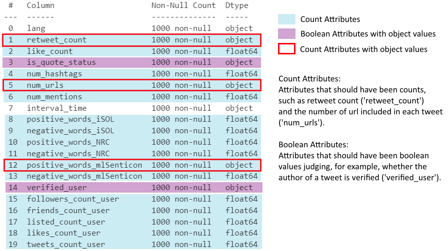
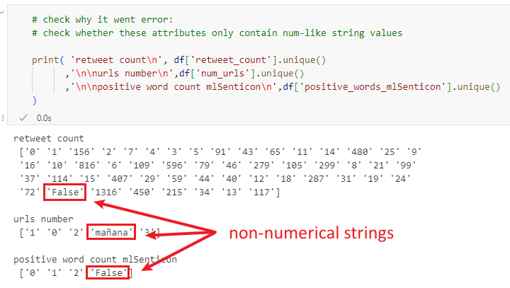
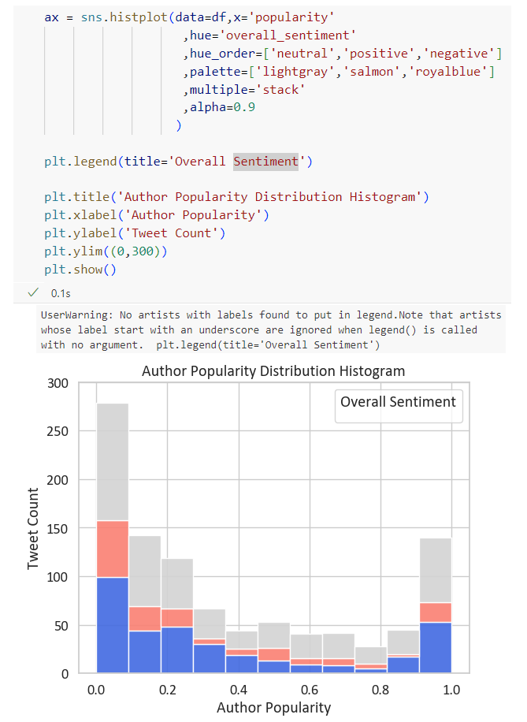

```{python}
#| eval: false
#| code-summary: 'Environment & Versions'
python==3.12
pandas==2.2.2
matplotlib==3.9.x
seaborn==0.13.2
```

# 简介

本项目使用一份关于西班牙加泰罗尼亚公投的 Twitter 推文数据集，属性包括每条推文的基本信息及由不同词典检测到的情感词计数 [@jimenezZafra2021]（属性详细说明见[附录一](#appendix-attributes)）。本文通过条形图展示各词典在推文情感检测上的表现差异，并以直方图按情感类别呈现所有推文的作者受欢迎度分布。

```{python}
# Import libraries
import pandas as pd   # data manipulation
import matplotlib.pyplot as plt   # plotting
import seaborn as sns   # plotting

# Load CSV
df = pd.read_csv(
    '../../../src/data/Catalan_Referendum_Twitter_corpus.csv',
    encoding = 'latin',  # non-utf-8 encoding
    delimiter = ';',
)

# Preview data
df.head()
```

# 数据处理

```{python}
## Drop missing values (see Appendix II)
df = df.dropna()

## Sample 1000 rows and reset index
df = df.sample(1000, random_state = 32).reset_index(drop = True)

## Rename columns for readability
# 1) unify favorite/favourites spelling
# 2) clarify statuses_count_user
df = df.rename(
    columns = {
        'favorite_count':'like_count',
        'favourites_count_user':'likes_count_user',
        'statuses_count_user':'tweets_count_user',
    }
)
```

## 计数属性设置

```{python}
# Inspect attribute datatypes
df.info()
```

{#fig-datatypes-attributes fig-alt="Datatypes and Attributes"}

```{python}
#| results: 'hold'
## Check dtypes of 3 object-type count attributes
print(df[['retweet_count', 'num_urls', 'positive_words_mlSenticon']].dtypes)

print("")

## Confirm all values are numeric strings (safe to cast with .astype())
print(
    df['retweet_count'].str.isnumeric().all(),
    df['num_urls'].str.isnumeric().all(),
    df['positive_words_mlSenticon'].str.isnumeric().all()
)

## Cast all count attributes to int
# object -> int
df[[
    'retweet_count', 'num_urls', 'positive_words_mlSenticon',
]] = df[[
    'retweet_count', 'num_urls', 'positive_words_mlSenticon',
]].astype(int)

# float -> int
float_cols = df.select_dtypes(include='float').columns  # all float columns
df[float_cols] = df[float_cols].astype(int)
```

## 布尔属性设置

```{python}
#| results: 'hold'
# Confirm bool columns only contain 'True'/'False' strings
print(df['is_quote_status'].unique())
print(df['verified_user'].unique())

# Cast string bool columns to bool
df['is_quote_status']=df['is_quote_status'].map({'True':True, 'False':False})
df['verified_user']=df['verified_user'].map({'True':True, 'False':False})
```

# 数据可视化

## 情感分布

```{python}
## Melt sentiment word count columns to long format for visualisation
# value_vars: all sentiment count columns (positive/negative for each lexicon)
# var_name: stores original column name (encodes sentiment and source)
# value_name: stores the corresponding count
df_melted = df.melt(
    value_vars = [
        'positive_words_iSOL','negative_words_iSOL',
        'positive_words_NRC','negative_words_NRC',
        'positive_words_mlSenticon','negative_words_mlSenticon',
    ],
    var_name = 'sentiment_and_source',
    value_name = 'count',
)

df_melted.head()  # initial melt result, before further processing
```

```{python}
#| label: fig-sentiment-bar
#| fig-cap: '加泰罗尼亚公投的网络情感'
## Add sentiment column (positive/negative)

# each returns a boolean Series checking
# if sentiment_and_source contains the keyword
is_positive = df_melted['sentiment_and_source'].str.contains('positive')
is_negative = df_melted['sentiment_and_source'].str.contains('negative')

# assign 'positive'/'negative' to the new sentiment column by index
df_melted.loc[df_melted[is_positive].index,'sentiment'] = 'positive'
df_melted.loc[df_melted[is_negative].index,'sentiment'] = 'negative'

## Add source column (lexicon name)
is_iSOL = df_melted['sentiment_and_source'].str.contains('iSOL')
is_NRC = df_melted['sentiment_and_source'].str.contains('NRC')
is_mlSenticon = df_melted['sentiment_and_source'].str.contains('mlSenticon')
df_melted.loc[df_melted[is_iSOL].index,'source'] = 'iSOL'
df_melted.loc[df_melted[is_NRC].index,'source'] = 'NRC'
df_melted.loc[df_melted[is_mlSenticon].index,'source'] = 'mlSenticon'

## Drop the now-redundant sentiment_and_source column
df_melted = df_melted.drop(columns = 'sentiment_and_source')
df_melted.head()  # sentiment and source are now separate columns

##############################################################################
## Set seaborn theme and plot bar chart

sns.set_theme(font = 'Arial', font_scale = 1.2, style = 'whitegrid')

sns.barplot(
    data = df_melted, x = 'source', y = 'count', hue = 'sentiment',
    # palette: salmon (warm) for positive, royalblue (cool) for negative
    palette = ['salmon', 'royalblue'], errorbar = None,
)
plt.title('Online Sentiment towards the Catalan Referendum')
plt.ylim(0, 0.7)  # set y-axis range
plt.xlabel('Emotion Analysis Lexicon')
plt.ylabel('Average Emotional Word Count')
plt.legend(title = 'Sentiment')
plt.show()
```

@fig-sentiment-bar 展示了所选加泰罗尼亚公投相关推文中，由三种情感分析词典（iSOL、NRC、mlSenticon）检测到的情感词平均计数，并按正面与负面情感分色呈现——暖红色"salmon"对应正面情感，冷蓝色"royalblue"对应负面情感，两者均为 Matplotlib 预定义颜色 [@matplotlibColors]。这两种颜色饱和度与亮度适中，有效避免视觉疲劳 [@wilke2019, chap. 19.1]。此外，颜色与情感的对应关系符合直觉，因为颜色的冷暖倾向通常与其所代表的情感相对应 [@hanada2018]，从而提升了图表的"数据-墨水比" [@wilke2019, chap. 23]。

总体而言，负面情感词的数量始终多于正面情感词，反映了网络公众对加泰罗尼亚公投的总体负面态度。

从各词典的表现来看，NRC 在判断话语情感倾向方面可能最为均衡；而 mlSenticon 在本项目中的效果相对较弱，其正负情感的计数均为三者中最低。

## 受欢迎度分布

以下公式用于计算推文作者的*受欢迎度* [@riquelme2016, pp. 6, 11]：

$$Popularity(i) = 1 - e^{-λ·Fi} $$

*受欢迎度*表示用户的知名程度，其中 *e* 为自然对数的底数，λ 为常数。引入*受欢迎度*旨在创建一个在直方图中分布合理的比率型属性，因为原始比率属性（如粉丝数）过于分散，难以直观呈现。

```{python}
#| label: fig-popularity-hist
#| fig-cap: '作者受欢迎度分布直方图'
## Define popularity calculation function
# F1: author follower count; e ≈ 2.718, λ = 0.001
def calc_popularity(F1):
    result = 1 - 2.718 ** (-0.001*F1)
    return result

## Add popularity column
# apply calc_popularity row-wise to followers_count_user
df['popularity'] = df['followers_count_user'].apply(calc_popularity)

## Define overall_sentiment function (based on iSOL lexicon)
def determ_sentiment(row):
    if row['positive_words_iSOL'] > row['negative_words_iSOL']:
        return 'positive'
    elif row['positive_words_iSOL'] < row['negative_words_iSOL']:
        return 'negative'
    else:
        return 'neutral'

## Add overall_sentiment column
# axis=1: apply function row-wise
df['overall_sentiment'] = df.apply(determ_sentiment, axis=1)

## Plot author popularity distribution histogram
ax = sns.histplot(
    data = df, x = 'popularity',
    hue = 'overall_sentiment',
    hue_order = ['neutral', 'positive', 'negative'],
    # palette: colors map intuitively to sentiment
    palette = ['lightgray', 'salmon', 'royalblue'],
    multiple = 'stack',  # stack groups
    alpha = 0.9  # transparency
)

# update legend title (see Appendix III)
ax.get_legend().set_title('Overall Sentiment')
plt.title('Author Popularity Distribution Histogram')
plt.xlabel('Author Popularity')
plt.ylabel('Tweet Count')
plt.ylim((0, 300))  # set y-axis range
plt.show()
```

@fig-popularity-hist 展示了推文按情感分组后的作者*受欢迎度*分布。总体而言，绝大多数参与者处于最低受欢迎度水平，随着作者*受欢迎度*的提升，推文数量逐渐减少，直至*受欢迎度*达到最高水平。此外，大多数推文为中立，而负面推文的数量多于正面推文。

# 反思

这两张图仅分析了数据集中有限数量的属性，仍有改进空间。在数据类型处理完成后，其他属性同样可用于可视化。例如，转发数和点赞数等基本信息属性可用于估算每条推文的互动程度，并以直方图加以呈现。

# 结论

本项目通过条形图分析了网络公众对加泰罗尼亚公投的总体态度，并比较了三种词典的表现。结果显示公众态度总体偏向负面，而 NRC 词典表现最为均衡。此外，受欢迎度较低的用户贡献了最多推文，这一结论通过按推文情感倾向分组的用户*受欢迎度*分布直方图得到呈现。

# 参考文献

::: {#refs}
:::

# 附录一：属性说明 {#appendix-attributes}

以下为[原始数据集](https://zenodo.org/records/4750661)的整体介绍及数据集提供者对各属性的描述。

> 本语料库共包含 46,962 条与加泰罗尼亚公投相关的推文。加泰罗尼亚公投是西班牙一场极具争议的独立公投，由加泰罗尼亚地区政府发起，后经西班牙政府申请，被西班牙宪法法院宣布中止。所有推文均于 2017 年 10 月 1 日以话题标签 #CatalanReferendum 或 #ReferendumCatalan 下载。2017 年 10 月 31 日，我们进一步收集了这些推文的特征，以分析其传播性。语料库中的每条记录由我们用于病毒式传播分析的推文特征构成。

## 推文元数据属性

| 属性 | 说明 |
|---------------------------------|---------------------------------------|
| `lang` | 推文语言 |
| `retweet_count` | 该推文被转发的总次数 |
| `favourite_count`<br>（重命名为 `like_count`） | 该推文被收藏的总次数 |
| `is_quote_status` | 该推文是否引用了其他推文 |
| `num_hashtags` | 推文中话题标签的总数 |
| `num_urls` | 推文中 URL 的总数 |
| `num_mentions` | 推文中提及用户的总数 |
| `interval_time` | 推文发布的时间段（早晨 06:00–12:00、下午 12:00–18:00、晚上 18:00–00:00 或深夜 00:00–06:00） |

## 情感词计数属性

| 属性 | 说明 |
|---------------------------------|---------------------------------------|
| `positive_words_iSOL` | 使用 iSOL 词典检测到的推文正面词总数 |
| `negative_words_iSOL` | 使用 iSOL 词典检测到的推文负面词总数 |
| `positive_words_NRC` | 使用 NRC 词典检测到的推文正面词总数 |
| `negative_words_NRC` | 使用 NRC 词典检测到的推文负面词总数 |
| `positive_words_mlSenticon` | 使用 ML-SentiCon 词典检测到的推文正面词总数 |
| `negative_words_mlSenticon` | 使用 ML-SentiCon 词典检测到的推文负面词总数 |

## 作者元数据属性

| 属性 | 说明 |
|---------------------------------|---------------------------------------|
| `verified_user` | 该推文是否来自认证用户 |
| `followers_count_user` | 关注该推文作者的用户总数 |
| `friends_count_user` | 该作者正在关注的好友总数 |
| `listed_count_user` | 将该推文作者加入列表的总数 |
| `favourites_count_user`<br>（重命名为 `likes_count_user`） | 该用户点赞的推文总数 |
| `statuses_count_user`<br>（重命名为 `tweets_count_user`） | 该账号自创建以来发布的推文总数 |

# 附录二：修改数据类型前的值验证 {#appendix-data-types}

最初，仅通过 `.dropna()` 方法删除特定子集中的缺失值（@fig-drop-na）。

{#fig-drop-na fig-alt="Dropping NAs from certain columns only"}

然而，随后在使用 `.astype()` 方法修改数据类型时发生了错误（@fig-astype-error）。

{#fig-astype-error fig-alt="Error when using .astype(int)"}

原因在于，这些属性中的字符串并非全部为数值型，因此无法直接通过 `.astype(int)` 转换为整数（@fig-non-num-str）。

{#fig-non-num-str fig-alt="Check non-numerical strings"}

因此，在应用数据类型转换方法前，有必要先验证所有字符串是否均为数值型。此外发现，若在最初直接使用不带关键字参数的 `.dropna()` 删除所有缺失值，则不产生报错的概率将大幅提升。

# 附录三：修改 Seaborn 直方图图例 {#appendix-legend}

@fig-popularity-hist（作者*受欢迎度*直方图）通过 seaborn 的 `.histplot()` 函数绘制，并通过设置 `hue` 参数按颜色分组（@fig-first-attempt）。此方式会自动生成图例，以列名 'overall_sentiment' 作为标题，但这并不适合作为图例标题。为此，尝试使用 `plt.legend()` 修改图例标题并保留其他信息，但效果不理想（如下图所示）。推测原因是 Seaborn 自动生成的图例与手动添加的 `plt.legend()` 之间存在冲突。

{#fig-first-attempt fig-alt="First Attempt"}

因此，将 `plt.legend()` 改为 `ax.get_legend().set_title()` ——该方法可检测当前图表中已生成的图例，并为其设置新标题。
