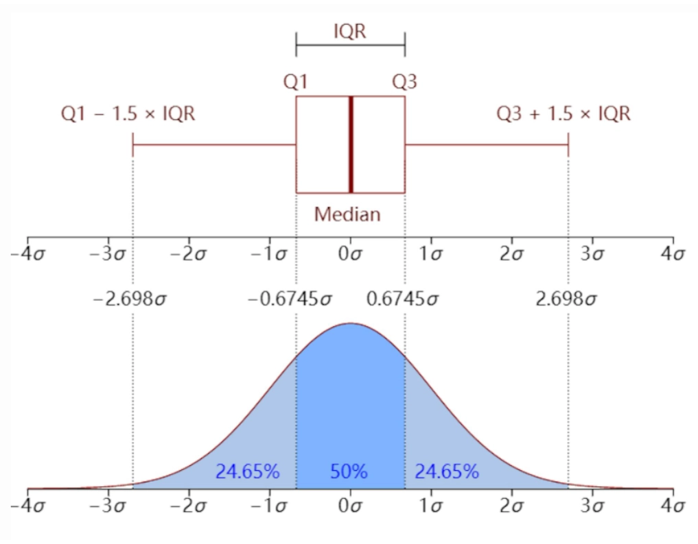

```{python}
#| eval: false
#| code-fold: true
#| code-summary: "环境和版本"
python==3.12
pandas==2.2.2
matplotlib==3.9.x
seaborn==0.13.2
```

# 1. Seaborn 与 Matplotlib

> **注:** 使用本地环境 (如 Jupyter, VS Code 等) 需先安装 Seaborn；若使用 Google Colab, 已预置, 无需手动安装。

```{python}
#| eval: false
pip install seaborn
```

```{python}
import seaborn as sns
import matplotlib.pyplot as plt
```

`matplotlib.pyplot` 通常缩写为 `plt`，以便快速调用绘图接口。不推荐使用完整路径：

```{python}
#| eval: false
import matplotlib.pyplot
matplotlib.pyplot.plot(略)
matplotlib.pyplot.show()
```

推荐写法：

```{python}
#| eval: false
import matplotlib.pyplot as plt  # 以 'plt' 为别名导入，便于后续调用
plt.plot(略)
plt.show()
```

- `mpl`：`matplotlib` 的别名，用于全局配置、底层属性及高级子模块（色彩映射、3D 绘图等）。
- `plt`：`matplotlib.pyplot` 的别名，用于快速创建和管理图表，是日常绘图的主要接口。

**参考：[matplotlib.pyplot 教程](https://matplotlib.org/stable/api/pyplot_summary.html)**

```{python}
df = sns.load_dataset('penguins')  # 加载企鹅示例数据集
df.info()  # 查看列名、数据类型及非空值数量
```

**float 数据**

长度、质量等浮点列为连续数值。有 true zero（0 代表"无"）的为 ratio data（如长度、质量）；无 true zero 的为 interval data（如温度）。

**object 数据**

种类名称（species）、岛名（island）等为 nominal data；性别（sex）为 ordinal data。

```{python}
df.head()  # 查看前五行
```

```{python}
df.tail()  # 查看后五行
```

```{python}
df.sample(5)  # 随机抽取五行
```

**注意：函数 (function) vs. 方法 (method)**

`df.info()`、`df.head()`、`df.tail()`、`df.sample()` 均为 DataFrame 对象的**方法**，必须基于具体对象调用，不可独立使用。

`pd.read_csv()` 为 Pandas 预定义的**函数**，可直接调用：

```{python}
#| eval: false
df = pd.read_csv('文件路径')
```

`df.sample()` 则为对 df 对象操作的方法：

```{python}
df.sample(4)
```

# 2. 绘制柱状图

## 2.1 用 Seaborn 绘制基础柱状图

### 2.1.1 基础柱状图

```{python}
# 基础柱状图：x 轴为类别，y 轴默认取均值；黑色误差线为 95% 置信区间
sns.barplot(data=df, x='island', y='body_mass_g')
plt.show()
```

```{python}
# estimator='sum'：将柱高改为求和（默认为均值）
sns.barplot(data=df, x='island', y='body_mass_g', estimator='sum')
plt.show()
```

**参考：[`sns.barplot()` 函数的用法](https://seaborn.pydata.org/generated/seaborn.barplot.html)**（`estimator` 参数）

```{python}
sns.__version__  # 查看当前 Seaborn 版本（0.13 起默认单色，避免无意义的颜色区分）
```

```{python}
# 验证：Biscoe 岛体质量均值即为柱状图对应的柱高
df.loc[df['island'] == 'Biscoe', 'body_mass_g'].mean()
```

### 2.1.2 Count Plot

```{python}
# 计数图：自动统计每个类别的出现次数
sns.countplot(data=df, x='species')
plt.show()
```

**参考：[`sns.countplot()` 用法](https://seaborn.pydata.org/generated/seaborn.countplot.html)**

## 2.2 柱分组 & 去除误差线

使用 `hue` 参数按类别分组，设置 `errorbar=None` 去除误差线。

```{python}
# hue 按性别分组显示，errorbar=None 去除误差线
sns.barplot(data=df, x='island', y='body_mass_g', errorbar=None, hue='sex')
plt.show()
```

**参考：[`sns.barplot()` 函数的用法](https://seaborn.pydata.org/generated/seaborn.barplot.html)**（`errorbar` 参数、`hue` 参数）

## 2.3 旋转刻度标签

x 轴标签过长时，可用 `plt.xticks()` 旋转标签：

```{python}
sns.barplot(data=df, x='island', y='body_mass_g', errorbar=None, hue='sex')

# 标签旋转 45°，ha='right' 使标签右端与刻度线对齐
plt.xticks(rotation=45, ha='right')
plt.show()
```

**参考：[`plt.xticks()` 函数用法](https://matplotlib.org/stable/api/_as_gen/matplotlib.pyplot.xticks.html)**（`kwargs` 栏目）

[Wilke (2019, chap. 6.1)](https://clauswilke.com/dataviz/visualizing-amounts.html#bar-plots) 建议：标签密集时，改为横向排版比旋转标签更易读：

```{python}
# 交换 xy 轴：标签密集时横向排版更易读
sns.barplot(data=df, y='island', x='body_mass_g', errorbar=None, hue='sex')
plt.show()
```

同样适用于 Count Plot：

```{python}
sns.countplot(data=df, y='species', hue='sex')
plt.show()
```

## 2.4 设置总主题风格

```{python}
# 设置全局绘图主题（作用于后续所有 Seaborn 图表，可用 sns.reset_orig() 还原）
sns.set_theme(font_scale=1.2, style='darkgrid')
```

`sns.set_theme()` 设置全局绘图主题，作用于之后所有 Seaborn 图表。调用 `sns.reset_orig()` 可恢复默认主题。

```{python}
# 定义一个图表对象 ax
ax = sns.barplot(
    data=df, x='body_mass_g', y='island',
    errorbar=None, hue='sex',
)

# 设置标题与轴标签
ax.set(title='Penguin', xlabel='Body Mass (g)', ylabel='Island')
plt.show()
```

将 Seaborn 图表赋值给变量 `ax` 后，可调用 Matplotlib 方法进一步修改（类似将 DataFrame 赋值给 `df` 后再调用方法）。

**注意：区分以下两者：**

- `sns.set()` / `sns.set_theme()`：Seaborn **全局**主题设置函数（两者等价，`sns.set_theme()` 为首选）。
- `ax.set()`：Matplotlib 中针对**特定图表对象**的方法，用于设置标题、轴标签等。

**参考：**\
[`sns.set()` 函数](https://seaborn.pydata.org/generated/seaborn.set.html)\
[`sns.set_theme()` 函数](https://seaborn.pydata.org/generated/seaborn.set_theme.html#seaborn.set_theme)\
[`ax.set()` 方法](https://matplotlib.org/stable/api/_as_gen/matplotlib.axes.Axes.set.html)

## 2.5 调整图例

无论 `errorbar=None` 还是 `errorbar=('ci',0)`，图例均可能遮挡图表，需用 `sns.move_legend()` 手动调整位置。

```{python}
# errorbar=None：图例自动置于右侧
ax = sns.barplot(data=df, y='island', x='body_mass_g', errorbar=None, hue='sex')
ax.set(title='Penguin', xlabel='Body Mass (g)', ylabel='Island')
plt.show()
```

```{python}
# errorbar=('ci', 0)：图例自动避让误差线区域
ax = sns.barplot(
    data=df, y='island', x='body_mass_g', 
    errorbar=('ci', 0), hue='sex',
)
ax.set(title='Penguin', xlabel='Body Mass (g)', ylabel='Island')
plt.show()
```

```{python}
ax = sns.barplot(data=df, y='island', x='body_mass_g', errorbar=None, hue='sex')
ax.set(title='Penguin', xlabel='Body Mass (g)', ylabel='Island')

# bbox_to_anchor + loc 联用：将图例的 loc 参考点移至坐标 (0.5, -0.2)
sns.move_legend(ax, bbox_to_anchor=(0.5, -0.2), loc='upper center', ncols=2)
plt.show()
```

```{python}
ax = sns.barplot(data=df, y='island', x='body_mass_g', errorbar=None, hue='sex')
ax.set(title='Penguin', xlabel='Body Mass (g)', ylabel='Island')
sns.move_legend(ax, loc='lower right')  # 仅设置 loc：图例移至图表右下角
plt.show()
```

```{python}
ax = sns.barplot(data=df, y='island', x='body_mass_g', errorbar=None, hue='sex')
ax.set(title='Penguin', xlabel='Body Mass (g)', ylabel='Island')

# 图例左上角置于图表 (1, 1) 处
sns.move_legend(ax, loc='upper left', bbox_to_anchor=(1, 1))
plt.show()
```

**参考：**\
[`sns.move_legend()` 用法](https://seaborn.pydata.org/generated/seaborn.move_legend.html)（`obj` 参数、`loc` 参数）\
[`matplotlib.axes.Axes.legend()` 用法](https://matplotlib.org/stable/api/_as_gen/matplotlib.axes.Axes.legend.html)（`loc`、`ncols`、`bbox_to_anchor` 参数）

## 2.6 修改颜色

使用 `palette` 参数修改图表配色，可传入以下类型的值：

1.  **Seaborn 预定义调色板名称**（默认 `'deep'`）：`'deep'`、`'muted'`、`'bright'`、`'pastel'`、`'dark'`、`'colorblind'`
2.  **Matplotlib Colormap 名称**：如 `'viridis'`、`'plasma'`、`'coolwarm'`、`'Blues'`、`'Reds'`
3.  **HLS/HUSL 颜色模型**：`'hls'`、`'husl'`
4.  **Cubehelix 方案**：`'ch:<args>'`，如 `'ch:s=0.5,r=-0.5'`（色盲友好，支持灰度打印）
5.  **渐变色**：`'light:<color>'`、`'dark:<color>'`
6.  **混合色**：`'blend:<color1>,<color2>'`
7.  **颜色代码列表**：十六进制（`['#FF5733', '#33FF57']`）、RGB 元组、Matplotlib 颜色名称

```{python}
# 默认调色板
ax = sns.barplot(data=df, y='island', x='body_mass_g', errorbar=None, hue='sex')
ax.set(title='Penguin', xlabel='Body Mass (g)', ylabel='Island')
sns.move_legend(ax, bbox_to_anchor=(1, 1), loc='upper left')
plt.show()
```

```{python}
# palette='flare'：使用 Seaborn 预设调色板
ax = sns.barplot(data=df, y='island', x='body_mass_g', errorbar=None, hue='sex', palette='flare')
ax.set(title='Penguin', xlabel='Body Mass (g)', ylabel='Island')
sns.move_legend(ax, bbox_to_anchor=(1, 1), loc='upper left')
plt.show()
```

```{python}
# palette 传入 Matplotlib 颜色名称列表
ax = sns.barplot(data=df, y='island', x='body_mass_g', errorbar=None, hue='sex', palette=['blue', 'orange'])
ax.set(title='Penguin', xlabel='Body Mass (g)', ylabel='Island')
sns.move_legend(ax, bbox_to_anchor=(1, 1), loc='upper left')
plt.show()
```

```{python}
# palette 传入十六进制颜色代码列表
ax = sns.barplot(
    data=df, y='island', x='body_mass_g', 
    errorbar=None, hue='sex', palette=['#a1c9f4', '#8de5a1'],
)
ax.set(title='Penguin', xlabel='Body Mass (g)', ylabel='Island')
sns.move_legend(ax, bbox_to_anchor=(1, 1), loc='upper left')
plt.show()
```

**参考：**\
[Seaborn `sns.set_theme()` 函数](https://seaborn.pydata.org/generated/seaborn.set_theme.html)（`palette` 参数）\
[Seaborn `sns.color_palette()` 函数](https://seaborn.pydata.org/generated/seaborn.color_palette.html)（预设调色盘名称表）\
[Matplotlib 预命名颜色一览](https://matplotlib.org/stable/gallery/color/named_colors.html)\
[Matplotlib Colormap 一览](https://matplotlib.org/stable/users/explain/colors/colormaps.html)\
[w3schools 颜色提取器](https://www.w3schools.com/colors/colors_picker.asp)

## 拓展：统计每个岛屿的企鹅数量

以下两种方式等效，可用于后续按总量排序柱状图。

**法1：`df.groupby().size()`**

```{python}
# 按 island 分组后统计每组行数
df.groupby('island').size()
```

**法2：`df.value_counts()`**

```{python}
# 统计 island 列中各值的出现次数
df.value_counts('island')
```

# 3. 绘制其他图

## 3.1 点线图

柱状图的纵轴必须从 0 开始，以保证视觉比例与数据比例一致（[Wilke (2019, chap.17)](https://clauswilke.com/dataviz/proportional-ink.html) 的 ***Principle of Proportional Ink***）。点线图无此限制，纵轴从数据范围起始，且 data-ink ratio 更高（干扰信息更少）。

当 x 轴为 nominal data（如岛屿名称）时，各点之间无需连线。

```{python}
# linestyle='none'：x 轴为离散类别时不连线；点上下的线段为误差线
sns.pointplot(data=df, x='island', y='body_mass_g', hue='sex', linestyle='none')
plt.show()
```

**参考：[`sns.pointplot()` 函数用法](https://seaborn.pydata.org/generated/seaborn.pointplot.html#)**

## 3.2 直方图

柱状图的 x 轴为**离散类别**（nominal/ordinal data）；直方图的 x 轴为**连续数值区间**（ratio data）。

```{python}
sns.histplot(data=df, x='flipper_length_mm')
plt.show()
```

```{python}
# hue 分组：各岛企鹅分别绘图后叠加显示
sns.histplot(data=df, x='flipper_length_mm', hue='island')
plt.show()
```

```{python}
# 统一 y 轴范围，对比有无 hue 分组的差异
sns.histplot(data=df, x='flipper_length_mm')
plt.show()

sns.histplot(data=df, x='flipper_length_mm', hue='island')
plt.ylim(0, 80)
plt.show()
```

```{python}
sns.histplot(
    data=df, x='flipper_length_mm',
    hue='island',
    stat='density',     # 各 bin 面积之和为 1（概率密度）
    common_norm=False   # 各组独立归一化 (每组面积和为1, 若 True 则所有面积和为1)
)
plt.show()
```

### 3.2.1 stat 参数

控制直方图的统计方式，可选值：

- `'count'`：bin 高度 = 该 bin 内的数据点数量（频数）。
- `'frequency'`：bin 高度 = 频数 / bin 宽度（单位宽度内的频数，适用于 bin 宽度不统一的情况）。
- `'probability'` / `'proportion'`：bin 高度 = 频数 / 总数，所有 bin 高度之和为 1。
- `'percent'`：bin 高度 = (频数 / 总数) × 100，所有 bin 高度之和为 100。
- `'density'`：bin 高度 = 频率 / 组距，所有 bin **面积**之和为 1（频率分布直方图）。当 bin 宽度趋近于 0 时，即得到平滑密度曲线。

```{python}
# stat='count'：柱高 = bin 内数据点数量
ax = sns.histplot(data=df, x='flipper_length_mm', stat='count')

# 遍历每个柱子（patch），获取高度并在柱顶显示数值标签
for p in ax.patches:
    # 获取柱子高度（即区间内的数据点频数）
    height = p.get_height()
    # 添加文字
    ax.text(
        p.get_x() + p.get_width() / 2,  # x(文字横坐标): 柱子中心位置
        height, # y(文字纵坐标): 柱子高度
        int(height), # str(文字内容): 显示整数频数
        ha='center', va='bottom', # horizontal/vertical anchor (水平/垂直对齐方式)
    )
plt.show()
```

```{python}
# stat='frequency'：柱高 = 频数 / bin 宽度
ax = sns.histplot(data=df, x='flipper_length_mm', stat='frequency')
for p in ax.patches:
    height = p.get_height()
    ax.text(
        p.get_x() + p.get_width() / 2, 
        height, int(height), 
        ha='center', va='bottom',
    )
plt.show()
```

```{python}
# stat='probability'：柱高 = 频数 / 总数，所有柱高之和为 1
ax = sns.histplot(data=df, x='flipper_length_mm', stat='probability')
for p in ax.patches:
    height = p.get_height()
    ax.text(
        p.get_x() + p.get_width() / 2, 
        height, f'{height:.2f}', # 保留两位小数
        ha='center', va='bottom',
    )
plt.show()
```

```{python}
# stat='percent'：柱高 = (频数 / 总数) × 100，所有柱高之和为 100
ax = sns.histplot(data=df, x='flipper_length_mm', stat='percent')
for p in ax.patches:
    height = p.get_height()
    ax.text(
        p.get_x() + p.get_width() / 2, 
        height, int(height), 
        ha='center', va='bottom',
    )
plt.show()
```

```{python}
# stat='density'：柱高 = 频率 / 组距，所有 bin 面积之和为 1
ax = sns.histplot(data=df, x='flipper_length_mm', stat='density')
for p in ax.patches:
    height = p.get_height()
    ax.text(
        p.get_x() + p.get_width() / 2, 
        height, f'{height:.3f}', 
        ha='center', va='bottom',
    )
plt.show()
```

### 3.2.2 common_norm 参数

布尔值，仅在 `stat` 为 `'probability'`、`'proportion'`、`'percent'` 或 `'density'` 时生效，默认为 `True`：

- `common_norm=True`：基于**整个数据集**归一化，不同组间的 bin 高度可直接比较。
- `common_norm=False`：各**子组独立**归一化，bin 高度仅在组内有意义。

```{python}
sns.histplot(
    data=df, x='flipper_length_mm', hue='island', 
    stat='density', common_norm=True, # 整体归一化：所有组的 bin 面积总和为 1
)
plt.show()
```

```{python}
sns.histplot(
    data=df, x='flipper_length_mm', hue='island',
    stat='density', common_norm=False, # 各组独立归一化: 每组 bin 面积之和分别为 1
)
plt.show()
```

分组重叠不清晰时，可用 `data=df[df['列']==值]` 筛选数据，为各组分别绘图：

```{python}
# 分岛绘图，避免分组叠加，逐一观察各岛分布
ax = sns.histplot(
    data=df[df['island'] == 'Torgersen'], 
    x='flipper_length_mm', stat='density'
)
ax.set(title='Torgersen Island', xlabel='Flipper Length (mm)')
plt.show()

ax = sns.histplot(
    data=df[df['island'] == 'Biscoe'], 
    x='flipper_length_mm', stat='density'
)
ax.set(title='Biscoe Island', xlabel='Flipper Length (mm)')
plt.show()

ax = sns.histplot(
    data=df[df['island'] == 'Dream'], 
    x='flipper_length_mm', stat='density'
)
ax.set(title='Dream Island', xlabel='Flipper Length (mm)')
plt.show()
```

**参考：[`sns.histplot()` 函数用法](https://seaborn.pydata.org/generated/seaborn.histplot.html)**（`hue`、`stat`、`common_norm` 参数）

## 3.3 箱线图

箱线图（boxplot）通过五个关键值概括数据分布：Min、Q1、Q2（中位数）、Q3、Max，并标记超出须范围的异常值。

- **箱体**：Q1 至 Q3，包含中间 50% 的数据。
- **箱内线**：中位数（Q2）。
- **须**：从 Q1/Q3 向外延伸，默认至 1.5 × IQR 范围内的极值。
- **异常值**：超出须范围的点单独标记。



**箱线图 vs. 直方图**


箱线图适合快速识别分布概况与异常值；直方图适合查看具体区间内的频率分布。

```{python}
sns.boxplot(data=df, x='flipper_length_mm', y='island', hue='sex')
plt.show()
```

```{python}
sns.boxplot(
    data=df, x='flipper_length_mm', y='island', hue='sex',
    fliersize=8,  # fliersize: 异常点大小（默认 5）
)
plt.show()
```

```{python}
sns.boxplot(
    data=df, x='flipper_length_mm', y='island', hue='sex', fliersize=8,
    whis=2,  # whisker:须延伸至 Q1/Q3 ± 2×IQR（默认 1.5），更大值减少异常点
)
plt.show()
```

**参考：[`sns.boxplot()` 函数用法](https://seaborn.pydata.org/generated/seaborn.boxplot.html)**（`fliersize`、`whis` 参数）

## 3.4 小提琴图

小提琴图结合了箱线图（中位数、分位数）与密度曲线（平滑分布）的特点。数据量较少时，平滑曲线可能失真，建议改用直方图或箱线图。

```{python}
sns.violinplot(data=df, y='island', x='flipper_length_mm', hue='sex')
plt.show()
```

```{python}
# split=True: 将同类别的两组合并为同一小提琴，便于对比分布形态
sns.violinplot(
    data=df, y='island', x='flipper_length_mm', hue='sex', 
    split=True, # 将两个 hue 不同的组分布合并为同一小提琴，便于对比分布形态
)
plt.show()
```

**参考：[`sns.violinplot()` 函数用法](https://seaborn.pydata.org/generated/seaborn.violinplot.html)**（`split` 参数）

## 3.5 条带图 & 蜂群图

**条带图 (strip plot)** 绘制所有数据点 (每点圆点是一个数据点) 并随机抖动 (同一数值下的点随机沿轴向抖动, 为了避免数据点重叠), 展示数据分布情况；**蜂群图 (swarm plot)** 自动排列重叠的数据点, 可读性更高。

注意：两者均展示单变量**分布**（某数据在各区间的密度），不同于展示两变量**相关趋势**的 scatter plot。

| 对比维度 | strip plot（散点条带图） | swarm plot（蜂群图） |
|-------------------|----------------------------|-------------------------|
| 基本概念 | 将数据点沿分类轴随机抖动（jitter）以避免重叠 | 通过算法精确排列点，避免重叠并展示分布 |
| 点的排列方式 | 随机抖动，可能仍有重叠 | 非随机，基于密度自动调整位置，完全避免重叠 |
| 可读性 | 数据量小时较清晰，数据量大时容易重叠 | 在中小规模数据中更清晰展示分布形状 |
| 计算复杂度 | 较低，绘制速度快 | 较高，数据量大时绘制较慢 |
| 适用场景 | 快速可视化、小数据集、对精确分布要求不高 | 展示数据分布细节、中等规模数据 |
| 分布表现能力 | 一般，难以体现真实密度 | 较强，可直观体现数据密度 |
| 参数控制 | 可通过 `jitter` 控制抖动程度 | 无需 jitter，由算法自动调整 |
| 示例函数 | `sns.stripplot()` | `sns.swarmplot()` |

```{python}
sns.stripplot(data=df, x='flipper_length_mm', y='island', hue='sex')
plt.show()
```

```{python}
sns.swarmplot(data=df, x='flipper_length_mm', y='island', hue='sex')
plt.show()
```

**参考：**\
[`sns.stripplot()` 函数](https://seaborn.pydata.org/generated/seaborn.stripplot.html)\
[`sns.swarmplot()` 函数](https://seaborn.pydata.org/generated/seaborn.swarmplot.html)

# 相关链接合集

> **总体链接：**\
> [**Python3 教程文档 (中文)**](https://docs.python.org/zh-cn/3/library/functions.html) (查看内置函数用法等)\
> [**Pandas库 教程文档**](https://pandas.pydata.org/docs/reference/frame.html) (DataFrame)\
> [**Matplotlib库 教程文档**](https://matplotlib.org/stable/api/pyplot_summary.html) (plt)\
> [**Seaborn库 教程文档**](https://seaborn.pydata.org/generated/seaborn.barplot.html) (barplot)
>
> [**`sns.barplot()` 函数**](https://seaborn.pydata.org/generated/seaborn.barplot.html)（用 Seaborn 绘制 柱状图）\
> [**`sns.countplot()` 函数**](https://seaborn.pydata.org/generated/seaborn.countplot.html) （用 Seaborn 绘制 计数图）
>
> **修改图表主题风格：**\
> [**`plt.xticks()` 函数**](https://matplotlib.org/stable/api/_as_gen/matplotlib.pyplot.xticks.html) （ ***kwargs*** (keyword argument) 栏目中写了如何旋转刻度标签）\
> [**`sns.set()` 函数**](https://seaborn.pydata.org/generated/seaborn.set.html) （同 `sns.set_theme()` 函数）\
> [**`sns.set_theme()` 函数**](https://seaborn.pydata.org/generated/seaborn.set_theme.html#seaborn.set_theme) （设置 Seaborn 绘图的全局主题风格）\
> [**`ax.set()` 方法**](https://matplotlib.org/stable/api/_as_gen/matplotlib.axes.Axes.set.html) （Matplotlib 中 对于特定图表 ax 设置标题、轴标签等元素的方法）
>
> **修改图例：**\
> [**`sns.move_legend()` 函数**](https://seaborn.pydata.org/generated/seaborn.move_legend.html) （Seaborn 中 移动图例的函数）（查看 ***obj参数*** 和 ***loc参数*** 的用法）\
> [**`matplotlib.axes.Axes.legend()` 函数**](https://matplotlib.org/stable/api/_as_gen/matplotlib.axes.Axes.legend.html) （Matplotlib 中 设置图例的函数，其指令也适用于 `sns.move_legend()`）（查看 ***loc参数*** ，***ncols参数*** 和 ***bbox_to_anchor参数*** 的用法）
>
> **修改图表颜色：**\
> [**Seaborn `sns.color_palette()` 函数**](https://seaborn.pydata.org/generated/seaborn.color_palette.html) （查看 ***palette参数*** 预设调色盘名称表）\
> [**Matplotlib 预命名颜色一览**](https://matplotlib.org/stable/gallery/color/named_colors.html)\
> [**Matplotlib Colormap 一览**](https://matplotlib.org/stable/users/explain/colors/colormaps.html)\
> [**Matplotlib Colormap 使用介绍**](https://matplotlib.org/stable/users/explain/colors/colormaps.html)\
> [**w3schools 颜色提取器**](https://www.w3schools.com/colors/colors_picker.asp) （查看任意颜色的十六进制代码）
>
> **其他图表：**\
> [**`sns.pointplot()` 函数用法**](https://seaborn.pydata.org/generated/seaborn.pointplot.html#) （点线图画法）\
> [**`sns.histplot()` 函数用法**](https://seaborn.pydata.org/generated/seaborn.histplot.html) （频率分布直方图画法）（查看 ***hue参数*** ，***stat参数*** 和 ***common_norm参数*** ）\
> [**`sns.boxplot()` 函数用法**](https://seaborn.pydata.org/generated/seaborn.boxplot.html) （箱线图画法） (查看 ***fliersize参数*** 和 ***whis参数*** )\
> [**`sns.violinplot()` 函数用法**](https://seaborn.pydata.org/generated/seaborn.violinplot.html) （小提琴图画法）\
> [**`sns.stripplot()` 函数**](https://seaborn.pydata.org/generated/seaborn.stripplot.html) （分布散点图画法）\
> [**`sns.swarmplot()` 函数**](https://seaborn.pydata.org/generated/seaborn.swarmplot.html) （分簇分布散点图画法）
>
> **教材书 *Fundamentals of Data Visualization* (Wilke, 2019) ：**\
> [**6.1 Bar Plot**](https://clauswilke.com/dataviz/visualizing-amounts.html#bar-plots) (旋转的文字刻度不方便阅读，应当横过来排版)\
> [**17. The Principle of Proportional Ink**](https://clauswilke.com/dataviz/proportional-ink.html) （比例标记的原则：图形大小比例应当和数据真实的比例一样。e.g. 柱状图的柱子应当从 0 开始）

[⇧ 返回页面顶部](#)