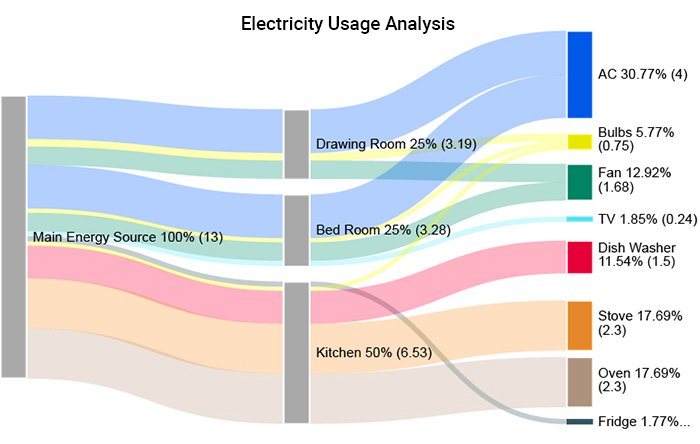
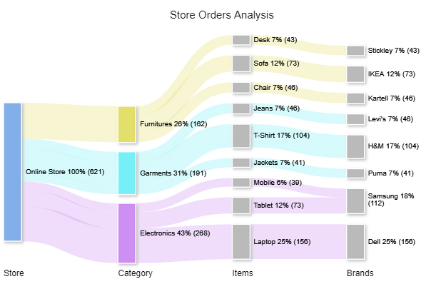
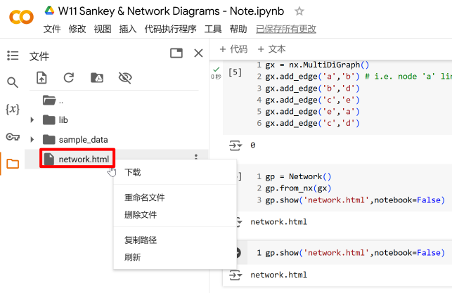
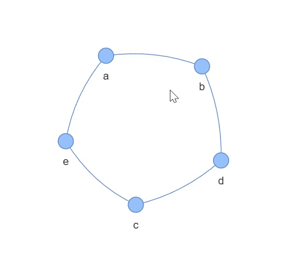
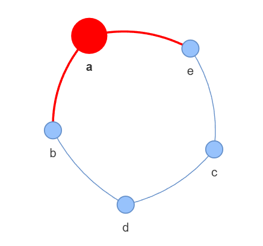
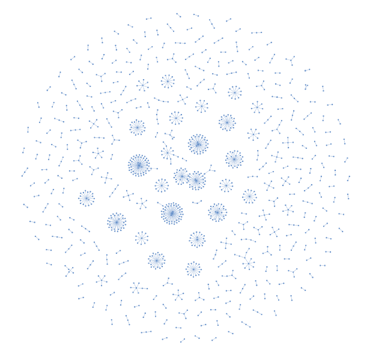
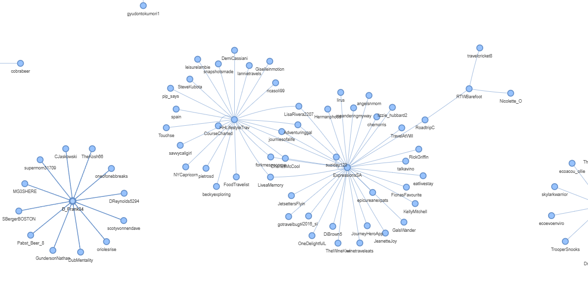

```{python}
#| eval: false
#| code-fold: true
#| code-summary: "环境与版本"
python==3.12
pandas==2.2.2
plotly==5.24.1
matplotlib==3.9.x
pyvis==0.3.2
networkx==3.3
```

# 桑基图

## 什么是桑基图

**桑基图（Sankey diagram）** 是一种特定类型的流程图，分支宽度对应数据流量大小，用于展示能量、金钱或材料的转移。因 1898 年 Matthew Henry Phineas Riall Sankey 绘制的"蒸汽机的能源效率图"而得名 [(百度百科)](https://baike.baidu.com/item/%E6%A1%91%E5%9F%BA%E5%9B%BE/10773057)。

桑基图由**节点 (node)** 和**链接 (link)** 构成。节点代表流程中的阶段或实体；链接表示节点间的资源流动，通常是有向的，从**源节点（source node）**指向**目标节点（target node）**。链接的**宽度**代表流量大小，颜色可区分不同阶段或类别。起始与结束流量守恒，各阶段分支宽度之和相等。

**例 1：** 下图 @fig-worker-month-expense 展示了打工人月度开销的流向，从"总费用"节点流向各具体项目节点。

{#fig-worker-month-expense}

[(图片来源: Peter, 2021)](https://blog.csdn.net/qq_25443541/article/details/118278484){.caption}

**例 2：** 下图 @fig-electricity-usage 展示了家中电能的流向：最左侧为总电能，中间为各房间，右侧为各电器；链接宽度代表流量，颜色区分电器类型。

{#fig-electricity-usage}

[(图片来源: PPCexpo, Example #2)](https://ppcexpo.com/blog/energy-flow-diagram){.caption}

**例 3：** 下图 @fig-store-orders 展示了购物网站订单分类：从总订单出发，按产品大类、细分类、品牌逐级展开；链接宽度代表订单数量，颜色区分商品大类。

{#fig-store-orders}

[(图片来源: ChartExpo, Example #5)](https://chartexpo.com/blog/sankey-diagram-in-excel#){.caption}


## Plotly Graph Object

此前学习使用了 `plotly.express`——Plotly 的高级接口，可通过简洁函数绘制基础图表。绘制桑基图需要使用更底层的接口 `plotly.graph_objects`。

> **低级接口（Low-Level Interface）**：提供基本函数，直接操作底层数据，需要编写较多代码。\
> **高级接口（High-Level Interface）**：提供高度整合的函数，使用方便但灵活性较低。\
> 例如，`matplotlib.pyplot` 是 Matplotlib 的高级接口（`plt.hist()`），而引入底层的 `matplotlib` 模块才能访问 `mpl.axes.Axes()` 等函数。

```{python}
# 通过低级接口接入 plotly 库，命名为 go
import plotly.graph_objects as go
```


## 函数和类

我们将使用 `go.Sankey()` 储存桑基图信息，再用 `go.Figure()` 将其绘制出来。严格来说，`go.Sankey()` 是一个**类（class）** 的 **构造函数 (constructor)**，调用它会创建一个储存桑基图数据的对象；`go.Figure()` 同理。

Python 中常用术语的对应关系见 @tbl-terminology：

| 概念 | 关联概念 | 示例 |
|:------:|:---------:|:------|
| 函数 (function) | 参数 (parameter) | `pd.read_csv(encoding='utf-8')` |
| 对象 (object) | 方法 (method) | `df.sample(size=10)` |
| 类 (class) | 属性 (property) | `go.Sankey(node=..., link=...)` |
| 对象 (object) | 属性 (attribute) | `df.columns` |

: Python 术语对应关系（注：`pd`、`go` 是库接口，`df` 是具体对象） {#tbl-terminology}


## 字典

**字典 (dict)** 是 Python 中以 **键值对 (key-value)** 形式存储数据的数据结构，有三种常见的创建方式：

```{python}
# 方法1
d1 = {'a': 1, 'b': 2, 'c': 3}  # key 必须加引号

# 方法2
d2 = dict(a=1, b=2, c=3)  # 无需加引号

# 方法3
keys = ['a', 'b', 'c']  # 分别定义 key 和 value
values = [1, 2, 3]
d3 = dict(zip(keys, values))  # 用 zip() 打包, 再用 dict() 转换成字典

print(d1)
print(d2)
print(d3)
```

**列表与字典的主要区别：**

- 列表有序，元素可重复，按位置 (index，从 0 开始) 查找元素。
- 字典无序，关键字不可重复 (值可以重复)，按关键字查找值。

```{python}
# 例: 动物与叫声
animal_with_sound = {'猫': '喵喵喵', '狗': '汪汪汪', '鸭': '嘎嘎嘎'}
sound = ['喵喵喵', '汪汪汪', '嘎嘎嘎']
```

```{python}
# 列表: 按位置序号(索引)查找元素
sound[0]
```

```{python}
# 字典：按关键字查找值 (注: 字典无序, 不能用索引查找)
animal_with_sound['猫']
```

## 绘制桑基图

参考资料：

> [Plotly 桑基图官方教程](https://plotly.com/python/sankey-diagram/)\
> [plotly.graph_objects.Sankey() 文档](https://plotly.com/python-api-reference/generated/plotly.graph_objects.Sankey.html)

### 构建桑基图对象

**第一步:** 用 `go.Sankey()` 创建桑基图对象。节点命名中 A/B/C 代表三个阶段，数字代表同一阶段内的不同节点。

```{python}
# go.Sankey() 函数的参数配置

sankey_data = go.Sankey(   # 定义 sankey_data 变量

    ##########################################################################
    # 节点 (node) 
    node = dict(

        # 节点标签
        label = ['A1','A2','B1','B2','C1','C2'], 
        
        # 节点颜色: 和节点标签一一对应
        color = [
            'yellow', 'yellow', 'tomato', 'tomato', 
            'cornflowerblue', 'cornflowerblue',
        ],

        # 节点间距 (padding) 和粗细 (单位: px)
        pad = 30,
        thickness = 20,

        # 节点外框线
        line = dict(
            color = 'black', # 外框线颜色
            width = 5,       # 外框线宽度 (单位: px)
        )
    ),

    ##########################################################################
    # 链接 (link)
    link = dict(
        
        # 源节点: 节点标签 (label) 列表中对应的索引
        source = [0, 1, 0, 2, 3, 3], 

        # 目标节点: 节点标签 (label) 列表中对应的索引
        target = [2, 3, 3, 4, 4, 5],

        # 链接流量大小: 与源节点和目标节点列表对应
        value = [8, 4, 2, 8, 4, 2],

        # 链接颜色: 和上面对应
        color = [
            'sandybrown', 'sandybrown', 'sandybrown', 
            'thistle', 'thistle', 'thistle',
        ],

        # 链接箭头长度: 从源节点指向目标节点 (默认为0, 即没有箭头)
        arrowlen = 15 
    )
)

##############################################################################
# 查看 sankey_data 的数据类型
print('数据类型:\n', type(sankey_data),'\n')

# 查看 sankey_data 的内容
print('内容:\n', sankey_data)
```

从输出结果可见, `sankey_data` 是一个 Plotly Sankey 对象，参数以字典形式多重嵌套储存。

构建 Sankey 对象时需要注意的是, 源节点和目标节点列表中的值是节点标签列表中对应节点的索引 (index), 而非节点名称本身。比如, `source = [0, 1, 0, 2, 3, 3]` 中的 `0` 代表第一个节点 'A1'，`1` 代表第二个节点 'A2'，以此类推。因此, 在构建数据时需要确保索引与节点标签列表中的顺序一致，否则会导致链接指向错误的节点。

### 绘制图像

**第二步：** 用 `go.Figure()` 绘制图像：

```{python}
# | label: fig-sankey-sample
# | fig-cap: "示例桑基图"
# 绘制图像
fig = go.Figure(sankey_data)

# 更新布局
fig.update_layout(
    height=400,
    title_text='示例桑基图',
    title_x=0.5, title_y=0.95, # 标题位置
    margin=dict(
        l=60, r=60, t=60, b=20,
    ),
    font={'style': 'italic'},
)

# 展示图像
# fig.show(renderer='notebook')  # if use VS Code or Jupyter, use this line
fig.show()
```

如 @fig-sankey-sample 所示, A/B/C 代表三个阶段, 数字代表同一阶段内的不同节点。链接宽度代表流量大小, 颜色区分不同阶段或类别。


### 预定义变量

随着节点增加，索引管理变得困难。为此，可以定义字典来实现 **通过节点名称查找对应索引** ，以便更直观地构建数据:

```{python}
# 定义列表变量储存节点名称
node_names = ['A1', 'A2', 'B1', 'B2', 'C1', 'C2']

# 通过 range(len()) 生成与节点对应的索引列表
node_ids = range(len(node_names))

# 构建 名称-索引 字典
nodes = dict(zip(node_names, node_ids))
```

```{python}
nodes['B2']  # 通过节点名称查找对应索引
```

这样就可以通过名称来查找 **源节点** 和 **目标节点** 在 **节点标签列表** 中的索引。

与此同时，对于很长的参数，可以 **先定义变量再填入函数**，使代码更清晰、易维护。以下代码重绘与上文 @fig-sankey-sample 所示相同的桑基图：

```{python}
#| label: fig-sankey-sample-new
#| fig-cap: "示例桑基图 - 重绘版"
##############################################################################
# 节点 (node) 参数所需值

# 定义节点颜色
node_colors = [
    'yellow', 'yellow', 'tomato', 'tomato',
    'cornflowerblue', 'cornflowerblue',
]

# 定义整个节点 (node) 参数
node_definition = dict(
    pad=15,
    thickness=20,
    line=dict(color='black', width=5),
    label=node_names,   # 使用上文创建的节点名称变量
    color=node_colors,  # 使用刚刚定义的节点颜色变量
)

##############################################################################
# 链接 (link) 参数所需值

# 通过节点名称查找索引来定义源节点和目标节点
sources = [
    nodes['A1'], nodes['A1'], nodes['A2'],
    nodes['B1'], nodes['B2'], nodes['B2'],
]
targets = [
    nodes['B1'], nodes['B2'], nodes['B2'],
    nodes['C1'], nodes['C1'], nodes['C2'],
]

# 定义链接流量大小和颜色
values = [8, 4, 2, 8, 4, 2]
link_colors = [
    'sandybrown', 'sandybrown', 'sandybrown',
    'thistle', 'thistle', 'thistle',
]

# 定义整个链接 (link) 参数
link_definition = dict(
    source=sources,
    target=targets,
    value=values,
    color=link_colors,
    arrowlen=15,
)

##############################################################################
# 绘制桑基图

# 把之前定义的 node_definition 和 link_definition 直接填入函数
fig = go.Figure(
    go.Sankey(
        node = node_definition,
        link = link_definition,
    )
)

# 更新布局
fig.update_layout(
    height=400,
    title_text='示例桑基图 - 重绘版',
    title_x=0.5, title_y=0.95,
    margin=dict(
        l=60, r=60, t=60, b=20,
    ),
    font={'style': 'italic'},
)
fig.show() # 展示图表
```

重绘结果与原图相同。但将数据定义为变量后，修改数据时只需调整变量值，让代码更清晰，便于维护。

### 修改颜色透明度

**修改链接颜色的透明度**，可以使用 RGBA 值代替颜色名称字符串。RGBA 格式为 `(red, green, blue, alpha)`，其中 `alpha` 表示不透明度（0 完全透明，1 完全不透明）。`"sandybrown"` 和 `"thistle"` 均为 CSS 预设颜色名称，可通过 [w3schools CSS Colors](https://www.w3schools.com/cssref/css_colors.php) 或 [Matplotlib 颜色表](https://matplotlib.org/stable/gallery/color/named_colors.html) 查阅。

```{python}
# 引入库用于处理 RGBA 值
import matplotlib.colors as c
```

```{python}
# 使用 c.to_rgba() 查找颜色 RGB 值并设置 alpha 值
c.to_rgba('sandybrown', 0.5)
```

Plotly 支持使用 `'rgba(r, g, b, a)'` 格式的字符串来指定 RGBA 格式的颜色。

```{python}
# 定义字符串储存透明色的 RGBA 值
faint_sandybrown = 'rgba' + str(c.to_rgba('sandybrown', 0.5)) # 加号用于连接字符串
faint_thistle = 'rgba' + str(c.to_rgba('thistle', 0.5)) 

# 查看字符串
print(faint_sandybrown)
print(faint_thistle)
```

```{python}
#| label: fig-sankey-sample-faint
#| fig-cap: "示例桑基图 - 链接透明度 50% 版"
# 重新定义链接颜色
link_colors = [
    faint_sandybrown, faint_sandybrown, faint_sandybrown,
    faint_thistle, faint_thistle, faint_thistle,
]

# 更新图表
fig.update_traces(link_color=link_colors)

fig.update_layout(
    height=400,
    title_text='示例桑基图 - 链接透明度 50% 版',
    title_x=0.5, title_y=0.95,
    margin=dict(
        l=60, r=60, t=60, b=20,
    ),
    font={'style': 'italic'},
)
fig.show()
```


# 网络图

## 网络图和桑基图的异同

桑基图和网络图均用于可视化关系数据，但侧重点不同，详见 @tbl-sankey-network：

| 特征 | 桑基图 | 网络图 |
|:------:|:--------:|:--------:|
| 主要用途 | 展示资源流动量 | 展示节点间连接关系 |
| 节点含义 | 流程阶段或实体 | 个体（如某一用户） |
| 连接名称 | 链接 (link) | 边 (edge) |
| 连接方向 | 有向（源→目标） | 可有向或无向 |
| 连接宽度 | 代表流量大小 | 无宽度区分 |
| 关键特征 | 层级化、流量守恒 | 连接强度与关系距离 |
| 应用示例 | 能量分布、成本分配 | 社交网络、计算机网络 |

: 桑基图与网络图对比 {#tbl-sankey-network}

## 绘制网络图

使用 `pyvis` 前需先安装（含 networkx）。

```{python}
#| eval: False
pip install pyvis
```

本地环境（Jupyter）安装后可复用；Google Colab 的虚拟环境仅对当前文件有效，新建文件需重新安装。

```{python}
# 引入库用于绘制网络图
from pyvis.network import Network
import networkx as nx
```

**第一步：用 networkx 创建网络关系**

```{python}
# 创建一个 边无向 的 空网格关系对象
gx = nx.Graph()
# 注: 也可用 nx.MultiDiGraph() 创建有向空网络
```

```{python}
# 在空网络 gx 里添加节点和边
gx.add_edge('a', 'b')  # 从 'a' 指向 'b' 的边
gx.add_edge('b', 'd')
gx.add_edge('c', 'e')
gx.add_edge('e', 'a')
gx.add_edge('c', 'd')
```

**第二步：用 pyvis 输出可交互网络图**

```{python}
#| output: false # not show output cell, but eval
# 创建空的可交互网络图对象
gp = Network()

# 从 gx 里读取网络关系
gp.from_nx(gx)

# 输出为单独的 html 文件
gp.show('net.html', notebook=False)
# notebook=False let the fig not be rendered in Jupyter output cell
# only use True when you are using Jupyter & browser
```

输出的的独立 HTML 文件会保存在当前目录下 ([查看源码和文件](https://github.com/Pinn32/dv-projects/tree/main/zh/tutorials/sankey-and-network))。在 Colab 中可在左侧文件栏看到，如 @fig-colab 所示。下载后用浏览器打开，效果见 @fig-network-sample。

{#fig-colab}

{#fig-network-sample width="60%"}

```{python}
print(gp.nodes[0])    # 查看第一个节点（index 为 0）的信息
```

**手动修改节点属性:**

```{python}
#| output: false
# 修改节点属性
gp.nodes[0]['color'] = 'red' # 颜色
gp.nodes[0]['size'] = 20     # 大小

# 修改后的文件重新命名，避免覆盖原文件
gp.show('net-modified.html', notebook=False)
```

修改后效果见 @fig-network-sample-modified：

{#fig-network-sample-modified width="50%"}

## 从文件中读取网络关系

除手动创建外，也可从 CSV 文件读取网络关系数据。以下示例使用 beer and curry 推文数据 [(查看源文件)](https://github.com/Pinn32/dv-projects/blob/main/src/data/beer-and-curry.csv): 原贴主艾特了其他用户，构成从原贴主 (源节点) 指向被艾特用户 (目标节点) 的有向边。

```{python}
#| output: false
###############################################################################
# 数据预处理

# 引入 pandas 库来处理 csv 文件
import pandas as pd

# 读取 csv 文件
path = '../../../src/data/beer-and-curry.csv'
df = pd.read_csv(path)

# 去除无艾特的行
df.dropna(subset='mentions', inplace=True)

###############################################################################
# 创建网络关系

# 创建有向空网络
gx1 = nx.MultiDiGraph()

# 定义循环, 遍历所有节点
for i in df.index:
    user = df.loc[i, 'user']              # 获取用户作为源节点
    mentions = df.loc[i, 'mentions']      # 获取一篇帖子里的所有艾特对象
    mentions = mentions.replace(' ', '')  # 移除空格
    mentions = mentions.split('@')        # 按 '@' 分隔不同艾特对象
    mentions.pop(0)                       # 分隔后首个元素为空字符, 去除

    for mention in mentions:
        gx1.add_edge(user, mention)       # 添加所有节点和边

###############################################################################
# 绘制网络图

gp1 = Network()   # 新建一个空网络图
gp1.from_nx(gx1)  # 存入把网络关系
gp1.show('net-from-csv.html', notebook=False)  # 输出 html 文件
```

输出的网络图较复杂，渲染需 1～2 分钟，请勿在此期间关闭浏览器。整体预览见 @fig-network-overview，细节见 @fig-network-detail。

{#fig-network-overview}

{#fig-network-detail}

网络图可用于研究社交网络，发现强/弱连接与高影响力用户，以及分析潜在的信息茧房 (information cocoon) 或 echo chamber 现象。
